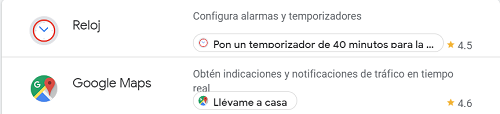

Para empezar necesitas instalar el asistente de Google en tu teléfono Android o Iphone:
Android: [Google Home Android](http://bit.ly/2LdE5pN)
Iphone: [Google Home Iphone](https://itunes.apple.com/es/app/google-home/id680819774?mt=8)

El assitente de Google puede ayudarte en tareas como: Temporizador, google maps, noticias, Alarmas:

Home Mini es una altavoz inteligente con el Asistente de Google integrado que siempre está lista para ayudarte.

