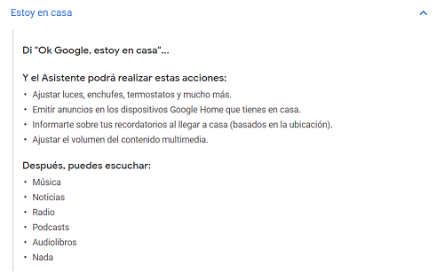

Para empezar necesitas instalar el asistente de Google en tu teléfono Android o Iphone:
* [Google Home (Android)](http://bit.ly/2LdE5pN)
* [Google Home (Iphone)](https://apple.co/2Y3CODo)

El assitente de Google puede ayudarte en tareas como: Temporizador, google maps, noticias, Alarmas:

Pero si integras los dispositivos domóticos con las aplicaciones de los componentes puedes crear rutinas y/o escenas para crear ambientes o simplemente acciones que se ejecutan con las frases predefinidas por ti

Ve al apartado Crear Rutinas Google Home para ver como se realizan.

