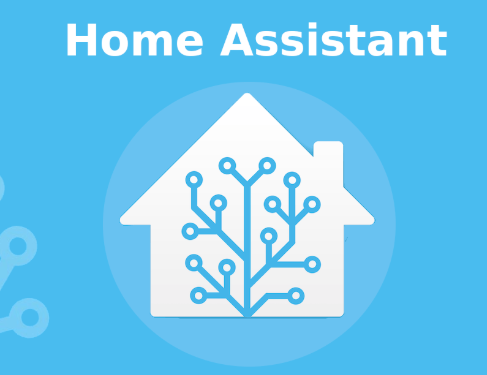

Hemos diseñado este blog con la intención de dar unas instrucciones sencillas
para integrar distintos dispositivos domóticos en una plataforma de domótica
de código abierto que se ejecuta en Python3.

## Home Assistant

También te da la posibilidad de rastrear y controlar todos los dispositivos del hogar y automatizar su control.

Aunque se utiliza código para integrar los elementos, intentaremos dar las instrucciones necesarias para cada tipo y modelo, así como, para integrarlos en el asistente de _Google Home_ y creación de las rutinas para su manejo por voz. 
