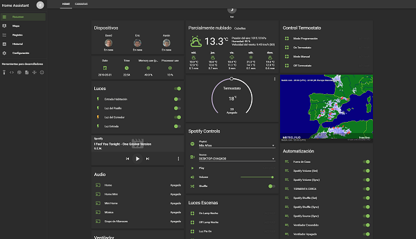

Home Assistant es una plataforma de domótica de código abierto que se ejecuta en Python3. También te da la posibilidad de rastrear y controlar todos los dispositivos del hogar y automatizar su control.

Home Assistant se suele montar en un dispositivo como un Raspberry Pi, Orange Pi Zero o **Windows** **(la mejor opción de entrada para poder aprender y no tener que invertir en un nuevo dispositivo)**
Lo que hacemos con este software es centralizar el control de todos estos aparatos para no tener que controlarlos de forma independiente.

Todo este sistema se puede gestionar de forma totalmente modular, pudiendo organizar a nuestro gusto todos los dispositivos de manera que podamos encontrarlos rápidamente cuando lo necesitemos y no tener que buscarlos dentro de una caótica interfaz como ocurre con otras plataformas similares.

**Home Assistant se integra con distintos servicios:** 
Home Assistant se encargará de controlar automáticamente el estado de todos los dispositivos inteligentes además de darnos la posibilidad de usar aplicaciones como _IFTTT_ para crear recetas, _Plex_, _Kodi_ o _Arduino_. Además, se puede integrar con una gran variedad de APIs como _HUE_, _Nest_, _WeMo_ y incluso dispositivos _Xiaomi_.

**Automatización** 
Home Assistant se basa en reglas para controlar el sistema. Todas las reglas cuentan con tres elementos:

* **Trigger**: lo que hace que se lance la regla.
* **Condition**: condición a comprobar para que se ejecute la regla.
* **Action**: acción que realiza la regla.

En cualquier de estos tres elementos cuentas con un motor de plantillas que te permite extender las comprobaciones a lago más de opciones como "si A entonces B".

Gracias a esta característica puedes crear variables, aplicar transformaciones y hacer comprobaciones todas las comprobaciones que consideres necesarias.

**Interfaz** 
Su interfaz esta basada en Material Design y cuenta con varias características interesantes como el soporte a WebSockets que permite al sistema reaccionar en tiempo real. Esto permite mostrar los valores de los sensores en cada momento sin necesidad de recargar la página.

Podemos decir en resumen que su interfaz es simple, clara y moderna, perfectamente adaptable a cualquier dispositivo.