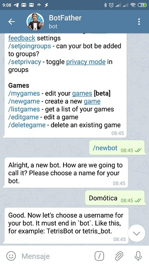
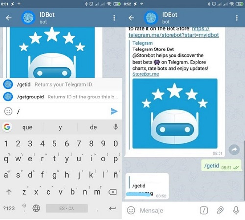

[ui-tabs position="top-left" active="0" theme="lite"]
[ui-tab title="Descripción ..."]

!!! _Cuándo nos proponemos tener una casa inteligente, nos damos cuenta que necesitamos estar informados de todos los cambios que pertenezcan a los dispositivos de la casa, si **se ha quedado la puerta de garaje abierta** al irnos, si **se  ha disparado la alarma cuando no estamos en casa** , o , si **se ha encendido el termostato por error**._


Todos **éstos cambios de estado se pueden automatizar con un mensaje** vía la Aplicación **_Telegram_**, un sistema de mensajería que, para aquellos que no lo conozcáis, es un estilo a _Whatsapp_, solo que, en mi opinión, es mucho mejor en todos los aspectos, entre ellos, con la existencia de los “bots”, es decir, robots con los que podemos interactuar y, en nuestro caso, **haremos que sea “la voz” de nuestra casa**. para ello necesitamos realizar unos pasos sencillos y podremos integrar éste servicio en nuestro sistema domótico. 


Si ya tenéis _Telegram_, podéis seguir **la guía de integración**, pero, para aquellos que no, os recomiendo que busquéis en vuestra tienda de aplicaciones, como _[Play Store](http://bit.ly/2VDrYay)_ o _[App Store](https://apple.co/30kq8u1)_, para descargarlo y ponerlo en marcha, al igual que se hace en _Whatsapp_. **Una vez que tengáis _Telegram_ en funcionamiento, podemos seguir para crear nuestro bot**, el cual, será el que nos informará y más adelante podrá recibir órdenes para poder hacer cosas en casa desde _Telegram_.

---
)](# "Subir arriba")

[/ui-tab]

[ui-tab title="Crear Bot..."]

+ **Como crear un bot de Telegram**:<br />
Buscamos el usuario _BotFather_, que és, el usuario que generará el bot:<br />

Ponemos `/start` y podemos empezar a ver la lista de comandos que necesitaremos, aunque, si queremos ver la lista completa, después de `/start`, podemos poner `/` y nos aparecerá la lista completa de los comandos que queremos:<br />

Escribimos `/newbot` para que empecemos la creación:<br />

Para el nombre, escribimos lo que queramos, ya que es el nombre mostrado, no el nombre de usuario, en mi caso he puesto _Domótica_:<br />

Posteriormente nos pide el nombre de usuario, y, en este lugar si que _Telegram_ obliga a que acabe en la palabtra _“bot”_, sea en mayúsculas o minúsculas, en mi caso he puesto _Domotizarmicasa_bot_:<br />

Ya tenemos nuestro bot y, como veis, _botfather_ nos da una **clave (token)** para poder hacer uso del bot por web.<br />


+ **Obtener nuestro ID de chat para integrar nuestro bot en Home Assistant**<br />
Para poder integrar en nuestra instalación necesitamos tan solo un dato, nuestro ID de conversación para que nuestro bot sepa a quien hablar, para eso, buscamos al bot _IDBot_:<br />

En el, pondremos `/start` y posteriormente el comando `/getid` y os contestará un número:<br />

Con ése número apuntado, ya podemos configurar nuestro _Home Assistant_ para comunicarse con nosotros desde _Telegram_:<br />

!! Puedes ver la integración en _Home Assistant_ en la **pestaña integración de arriba** . <br />
[](#)


[/ui-tab]
[ui-tab title="Integración..."]

**Para Integrarlo en Home Assitant**<br />
+ Vamos a usar la llamada `Telegram Polling` para poder mandar mensajes a nuestro usuario en Telegram. Para ello, abriremos el `configuration.yaml` y añadiremos lo siguiente:<br />

```text

telegram_bot:
  platform: polling
  api_key: 719825869:AAGA9CRytgCMkF3FGX0oPE_cDOdUAuxG9g0Q
  allowed_chat_ids:
    - 77685961    

```
+ Para crear el notificador, `configuration.yaml`:

```text

notify:
  - name: telegram
    platform: telegram
    chat_id: 77685961 

```
---

[/ui-tab]

[/ui-tabs]