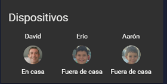

#### nMap ###
#### (Rastreador dispositivos conectado a la red) ####

**Instalando este rastreador de dispositivos en un sistema conectado a nuestra red, podremos crear automatizaciones en Home Assistant basadas en nuestra presencia en nuestra casa.**

Puedes descargarlo desde aqui: [nMap para Windows](http://bit.ly/2Lud6Xs)

Nmap ("Network Mapper") es una herramienta de código abierto para la exploración de redes y la auditoría de seguridad. Fue diseñado para escanear rápidamente redes grandes, aunque funciona bien contra hosts individuales. Nmap utiliza paquetes de IP sin procesar en formas novedosas para determinar qué hosts están disponibles en la red, qué servicios (nombre y versión de la aplicación) ofrecen esos hosts,
qué sistemas operativos (y versiones de sistema operativo) están ejecutando, qué tipo de filtros de paquetes / cortafuegos están en uso, y docenas de otras características. Si bien Nmap se usa comúnmente para auditorías de seguridad, muchos administradores de sistemas y redes lo encuentran útil para tareas rutinarias como el inventario de redes, la administración de programas de actualización de servicios,
y monitoreando el tiempo de actividad del host o del servicio.

Para editar el archivo `configuration.yaml` recomendamos que utilices [_++Notepad_](https://notepad-plus-plus.org/repository/7.x/7.6.6/npp.7.6.6.Installer.exe)

Para la configuración de **"nmap device tracker"** debes añadir ésto en tu `configuration.yaml`:

```
device_tracker:
  - platform: nmap_tracker
    hosts: 192.168.1.0/24
```  
Una vez añadido y guardado el archivo `configuration.yaml` ,debes reiniciar Home Assistant.

La salida de Nmap es una lista de objetivos escaneados, que se guardan en un fichero `known_devices.yaml` dentro de la carpeta de la configuración de `.homeassistant`, los cuales podrás editar y nombrar e incluso poner una imagen personalizada


```
b0_e1_7e_2a_6a_ca:
  hide_if_away: false
  icon:
  mac: B0:E1:7E:2A:6A:CA
  name: Eric                    # <- Nombre del dispositivo o del ususario
  picture:  /local/Eric1.jpg    # <- imagen del dispositivo o del usuario
  track: true                   # <- mostrar: `true` /  ocultar: `false`
  
```
La imagen debes tenerla en una carpeta, dentro de `.homeassistant`, y llamarla `www`, si no la tienes debes crearla.

  
    


