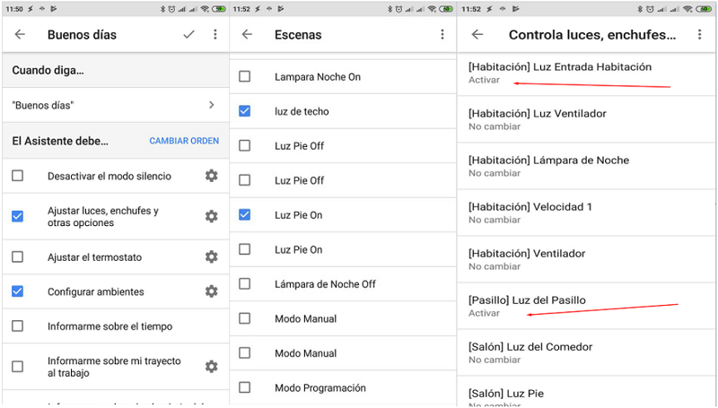

### Programar una rutina personalizada ###
Puedes programar rutinas personalizadas para que se inicien automáticamente en un altavoz inteligente. Solo tienes que definir el día y la hora que quieras.

Abre la aplicación Google Home.
En la esquina inferior derecha de la pantalla de inicio, toca Cuenta .
Comprueba que la cuenta de Google que aparece sea la que está vinculada a Google Home.  Para cambiar de cuenta, toca el triángulo situado a la derecha del nombre de la cuenta.
Toca Ajustes  y después pestaña Asistente y después Rutinas y después add_routine.
En "Cuando..."

Toca Añadir comandos y después plus y después introduce la frase que quieras decir para activar la rutina y después Back.

Toca Establecer una hora y un día (opcional) y después Elige una hora para esta rutina y después Back.

Elige un horario en Elige los días en que se debe repetir.

Selecciona el altavoz en Elige qué altavoz la empezará.

Si quieres recibir una notificación en el teléfono cuando se inicie la rutina, marca la casilla correspondiente.

Toca Back.

En "El Asistente debe..."

Toca Añadir acción y después Introduce lo que debería hacer el Asistente. Puedes introducir cualquier comando del Asistente de Google o elegir entre distintas acciones populares y después Añadir.
Nota: No puedes asignar consultas de voz de varias tareas a una acción.

Opcional: En "Y, a continuación, reproducir..."

Toca Añadir archivo multimedia.

Toca el círculo que está junto a la fuente de medios. Nota: Puedes personalizar lo que se reproduce tocando Settings gear junto a la fuente.

Toca Añadir y después Done.

En la esquina superior derecha, toca Done.