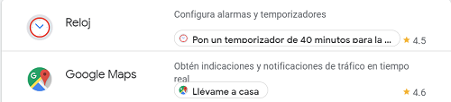
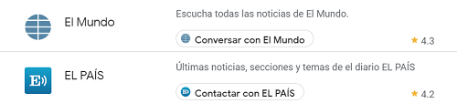
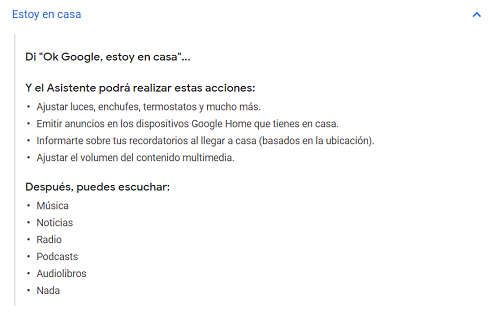
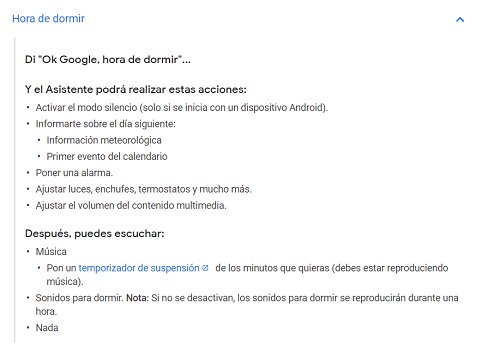

Para empezar necesitas instalar el asistente de Google en tu teléfono _Android_ o _Iphone_:
* [Google Home (Android)](http://bit.ly/2LdE5pN)
* [Google Home (Iphone)](https://apple.co/2Y3CODo)

El assitente de Google puede ayudarte en tareas como: **Temporizador**, **GoogleMaps**, **noticias**, **alarmas** :

Pero si integras los dispositivos domóticos con las aplicaciones de los componentes puedes crear rutinas y/o escenas para crear ambientes o simplemente acciones que se ejecutan con frases predefinidas por ti:

+ Ver el capítulo [_Rutinas en Google Home_](/google-home/rutinas-en-google-home) para ver como se realizan.

