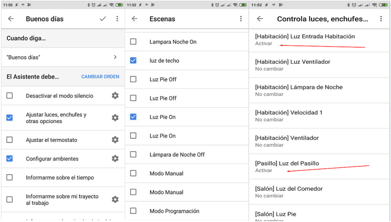

### Programar una rutina personalizada ...
Puedes programar rutinas personalizadas para que se inicien automáticamente por ejemplo, en un altavoz inteligente: Solo tienes que definir el día y la hora que quieras...
+ inícia la aplicación _Google Home_.
+ En la esquina inferior derecha de la pantalla de início, **toca** en _Cuenta_ .
+ Comprueba que la cuenta de Google que aparece sea la que está vinculada a _Google Home_.  Para cambiar de cuenta, **toca** el triángulo situado a la derecha del nombre de la cuenta.
+ **Toca** _Ajustes_ y después en la pestaña _Asistente_ , después en _Rutinas_ y finalmente _add_routine_ en el apartado "_Cuando..._"

+ **Toca** _Añadir comandos_, después _plus_ e introduce la frase que quieras decir para activar la rutina y después _Back_. 
+ **Toca** Establecer una _hora y un día_ (opcional) elige una hora para esta rutina y después _Back_. 
+ Fija un horario en _Elige_ los días en que se debe repetir. 
+ Selecciona el altavoz en _Elige_ qué la iniciará. 
+ Si quieres recibir una notificación en el teléfono cuando se inicie la rutina, marca la casilla correspondiente. y **Toca** _Back_. 

#### En el apartado _El Asistente debe..._

+ **Toca** _Añadir acción_ e introduce lo que debería hacer el Asistente. Puedes introducir cualquier comando del _Asistente de Google_ o _elegir_ de entre distintas acciones populares y después _Añadir_.

!! Nota: No puedes asignar consultas de voz de varias tareas a una acción.
!! Opcional: En "Y, a continuación, reproducir..."

+ **Toca** _Añadir_ archivo multimedia.
+ **Toca** el círculo que está junto a la fuente de medios.

!! Nota: Puedes personalizar lo que se reproduce tocando Settings gear junto a la fuente.

+ **Toca** _Añadir_ y después _Done_. En la esquina superior derecha, **toca** _Done_.