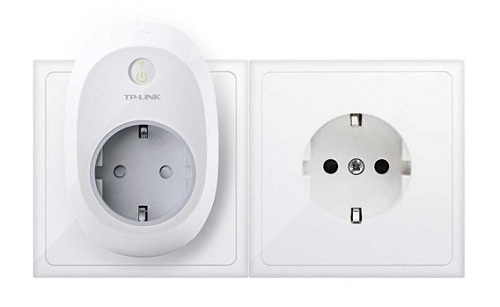

## TP-Link HS100 y HS110 ##

TP-Link cuenta con dos modelos con WiFi, el HS100 y el HS110. Ambos cuentan con las mismas funciones de control mediante la aplicación, programación, modo de simulación de que hay gente en casa, etc. Sin embargo, el HS110 también mide el consumo energético de los aparatos que le conectamos, y saca resúmenes semanas y mensuales. Podemos controlarlo con la voz con Google Home

Amazon: [TP-Link HS100](https://amzn.to/2Lj7sHB)