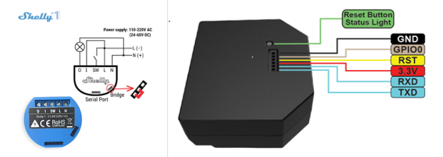

[ui-tabs position="top-left" active="0" theme="lite"]
[ui-tab title="Descripción ..."]

> **¿Qué es un interruptor inteligente?**<br />
Los interruptores WiFi al igual que los tradicionales se instalan conectándolos a la red eléctrica del interruptor convencional, pero a diferencia de los tradicionales te permiten instalar una aplicación de control en tu smartphone y con la que manejar a distancia este interruptor. **Puedes establecer un horario, apagarlo o encenderlo de forma remota.**


**Interruptores de luz inteligentes: Cosas a considerar:**
A diferencia de las luces inteligentes , los interruptores **requieren un poco más de consideración.** Puede parecer un caso de simplemente sacar tu interruptor existente e intercambiarlo por uno nuevo, **pero hay cosas que debes considerar (cableado, medidas, compatibilidad)**.
Éstos interruptores **requieren un cable de fase adicional** (normalmente color azul, dentro de tu instalacion), para la alimentacion del dispositivo wifi.
**También debes tener en cuenta** que éstos dispositivos, en caso de **reemplazo de los existentes**, si los existentes son conmutados, **pierdes uno de los conmutados**, cosa que no agrada demasiado.

**Otra opción, en vez de reemplazar los interruptores**, són los dispositivos **_Shelly_**, són disposivos que se instalan en las cajas de empalme de la casa,  con los cables de los interruptores existentes, por lo que **mantienes la función de los interruptores, y además, están enlazados por wifi.**. **_Shelly 1_**  (una fase) **_Shelly 2,5_** (dos Fases).

Pero los interruptores de luz inteligentes te otorgan un control inteligente sobre las luces «tontas» que ya se encuentran en tu hogar; no solo puedes encenderlas o apagarlas a miles de kilómetros de distancia, sino que también podrás ajustar el brillo y, en algunos casos, el color. Si tienes algún accesorio de iluminación en tu hogar que sea incompatible con bombillas inteligentes, el interruptor que buscas deberá ser un interruptor inteligente.

Nuestro consejo es hacer un análisis costo-beneficio. Conectar tu casa con interruptores de luz inteligentes puede ser una tarea costosa, especialmente con casas más grandes. Pero luego, el coste de instalar bombillas inteligentes y enchufes inteligentes en toda la casa puede costar más a largo plazo.

---

[ui-accordion independent=true open=none]

[ui-accordion-item title="Sonoff Basic | Amazon » 5,81€ -  Aliexpress » 4,99€ "]
|  |  |
|:-------------|:-------------:|
| <p>[**Sonoff Basic Interruptor Inteligente...**](https://amzn.to/2Hbfsor)</p><p>Sonoff Basic es un interruptor inteligente WiFi<br /> que permite encender y apagar remotamente <br />un aparato eléctrico.<br /> Este dispositivo eléctrico transmite<br /> datos a través de su router <br />WiFi, permitiendo a los usuarios controlar<br /> de forma remota todos los dispositivos<br /> conectados a través de la aplicación móvil<br /> **_eWeLink_**. </p><p> | ![200x200][amzn-basic][![buy-mzn!][buy-mzn]](https://amzn.to/2Hbfsor)</p>[![buy-aliex][buy-aliex]](http://s.click.aliexpress.com/e/b91hZB3S)</p> |
[/ui-accordion-item]

[ui-accordion-item title="Sonoff touch EU | Amazon » 21,33€ -  Aliexpress » 10,95€ "]
|  |  |
|:-------------|:-------------:|
| <p>[**Sonoff Smart Wi-Fi Interruptor de luz táctil...**](https://amzn.to/2J8kDsY)</p><p>Controle sus electrodomésticos o dispositivos<br /> eléctricos en cualquier momento y en<br /> cualquier lugar. Donde quiera que esté,<br /> y siempre que desee encender/apagar sus <br />electrodomésticos o dispositivos eléctricos,<br /> no necesita estar allí o la ayuda de los demás,<br />  solo necesita tocar<br /> ligeramente el botón ON/OFF <br />en la aplicación **_Ewelink_**. <br />Los dispositivos conectados se encenderán<br />  o apagarán automáticamente.<br /> La aplicación inteligente<br /> **_Ewelink_** es compatible con teléfonos<br /> inteligentes o tabletas<br /> con Android e IOS.</p><p> | ![200x200][amzn-touch2][![buy-mzn!][buy-mzn]](https://amzn.to/2J8kDsY)</p>[![buy-aliex][buy-aliex]](http://s.click.aliexpress.com/e/ERgGkIy)</p> |
[/ui-accordion-item]

[ui-accordion-item title="Sonoff 2 Gang Wifi | Amazon » 22,98 - Aliexpress » 17,71€ "]
|  |  |
|:-------------|:-------------:|
| <p>[**Sonoff T1 WiFi Touch 2 Gang...**](https://amzn.to/2Jp3Gtp)</p><p>Encendido / apagado remoto: enciende/apaga<br /> las luces desde cualquier lugar.<br /> Soporte de aplicaciones: aplicación <br />móvil gratuita iOS y Android **_eWeLink_**.<br /> Control independiente: controla cada grupo<br /> por separado. Timers para encender/apagar<br /> a la hora especificada. Control compartido:<br /> controle su casa inteligente<br /> junto con su familia. Compatibilidad:<br /> Amazon Alexa, Asistente de Google.</p> | ![200x200][amzn-touch1][![buy-mzn!][buy-mzn]](https://amzn.to/2Jp3Gtp)</p>[![buy-aliex][buy-aliex]](http://s.click.aliexpress.com/e/bQ01Ojfi) |
[/ui-accordion-item]

[ui-accordion-item title="Sonoff 3 Gang WiFi | Amazon » 23,75€ -  Aliexpress » 19,08€ "]
|  |  |
|:-------------|:-------------:|
| <p>[**Sonoff 3 Gang WiFi...**](https://amzn.to/2LE8r5o)</p><p>Mismo dispositivo que el anterior con 3<br /> pulsadores para controlar 3 puntos de luz<br /> desde el mismo componente.<br />Encendido / apagado remoto: enciende o<br /> apaga las luces desde cualquier lugar.<br /> Soporte de aplicaciones: aplicación móvil<br /> gratuita iOS y Android eWeLink.<br /> Control independiente: controla cada grupo<br /> por separado. Timers para encender / apagar<br /> a la hora especificada.<br /> Control compartido: controle su casa<br /> inteligente junto con su familia.<br /> Compatibilidad: Amazon Alexa, <br />Asistente de Google, IFTTT.</p> | ![200x200][amzn-touch3][![buy-mzn!][buy-mzn]](https://amzn.to/2LE8r5o)</p>[![buy-aliex][buy-aliex]](http://s.click.aliexpress.com/e/LenLi2c) |
[/ui-accordion-item]

[ui-accordion-item title="Conmutador Shelly 1 | Amazon » 22,99€ "]
|  |  |
|:-------------|:-------------:|
| <p>[**Conmutador Shelly 1...**](https://amzn.to/2Lunn5V)</p><p>Transformar un hogar o una oficina<br /> en inteligente no requiere de complejas<br /> instalaciones. Interruptor de relé<br /> Wi-Fi **_Shelly1_**, que con sus compactas<br /> dimensiones 41x36x17 mm el instalador<br /> podrá acoplarlo detrás de cualquier contacto<br />  de alimentación, interruptor de luz estándar,<br /> o directamente en una caja de DIN<br /> en la caja de electricidad. </p><p> | ![200x200][amzn-shelly1][![buy-mzn!][buy-mzn]](https://amzn.to/2Lunn5V)</p> |
[/ui-accordion-item]

[ui-accordion-item title="Interruptor Cortina o Persianas WiFi  | Amazon » 20,99€ "]
|  |  |
|:-------------|:-------------:|
| <p>[**Interruptor Cortina o Persianas WiFi...**](https://amzn.to/2JqiQ1O)</p><p>El interruptor de cortina Wifi puede funcionar con cortinas inteligentes, puertas eléctricas, puertas de garaje inteligentes y otros aparatos. El método de instalación se puede instalar en tan solo unos minutos como el interruptor ciego tradicional. Los interruptores táctiles le brindan diferentes experiencias cuando lo usa.(Este interruptor táctil wifi necesita conectarse con un cable neutro).</p> | ![200x200][amzn-persiana][![buy-mzn!][buy-mzn]](https://amzn.to/2JqiQ1O)</p> |
[/ui-accordion-item]

[/ui-accordion]

<!--- REFERENCIA A IMAGENES AL PIE DEl ARTÍCULO --->

[amzn-touch2]: user://pages/02.interruptores/sonoff_touch2.png?lightbox=1024&cropResize=200,200
[amzn-touch1]: user://pages/02.interruptores/touch1.png?lightbox=1024&cropResize=200,200
[amzn-basic]: user://pages/02.interruptores/basic.png?lightbox=1024&cropResize=200,200
[amzn-touch3]: user://pages/02.interruptores/sonoff_touch3.png?lightbox=1024&cropResize=200,200
[amzn-shelly1]: user://pages/02.interruptores/shelly11.png?lightbox=1024&cropResize=200,200
[amzn-persiana]: user://pages/02.interruptores/Persiana.png?lightbox=1024&cropResize=200,200
[buy-mzn]: https://dabuttonfactory.com/button.png?t=Comprar+en+AMAZON!&f=Roboto-Bold&ts=18&tc=fff&w=200&h=40&c=5&bgt=unicolored&bgc=037ba2
[buy-aliex]: https://dabuttonfactory.com/button.png?t=Comprar+en+ALIEXPRESS!&f=Roboto-Bold&ts=16&tc=fff&w=200&h=40&c=5&bgt=unicolored&bgc=ffae00

---

[/ui-tab]

[ui-tab title="Integración ..."]

La **Integración en Google Home** es muy secilla, solo tienes que añadir la cuenta que creas de la aplicacion del disposivo, en este caso sera **_eWelink_**, para los dispositivos **-Sonoff_** y **_Shelly Cloud_**, para los dispositivos **_Shelly_**, en la configuración de añadir dispositivos de _Google Home_, aquí tenéis los enlaces para descargar la que necesitéis:
 * [**eWelink android**](http://bit.ly/304iAeG)
 * [**eWelink Iphone**](https://apple.co/2VO5ZwV)    
 * [**Shelly Cloud android**](http://bit.ly/2DYDjHj)
 * [**Shelly Cloud Iphone**](https://apple.co/2WuWTCk)

###### **_(Aúnque en el Ejemplo usamos la aplicación Kasa, el procedimiento para la integración és el mismo, utilizando la aplicación correcta del componente, arriba indicada, según proceda)._**.###### 


**Para Integrarlo en Home Assitant**

+ Ejemplo configuración dispositivos **_Shelly_**  `configuration.yaml`:

```text

switch:
  - platform: rest
    name: "Shelly2 Switch1"
    scan_interval: 5
    resource: http://192.168.0.28/relay/0    (IP de nuestro Shelly1)
    body_on: 'turn=on'
    body_off: 'turn=off'
    is_on_template: '{{ value_json.ison == true}}'
    headers:
      content-type: application/x-www-form-urlencoded

```
+ Ejemplo configuración dispositivos **_Sonoff_**  `configuration.yaml`:

```text

sonoff:
  username: nuestrocorreo@correo.es
  password: nuestracontraseña
  scan_interval: 60
  grace_period: 600
  api_region: 'eu'

```
###### _"En el caso de la configuración de los disposivos **Sonoff**, la aplicación **eWelink**, **no permite estar abierta en dos aplicaciones al mismo tiempo**,así que, recomiendo que abras otra cuenta de correo, solo para Home Assistant, y que désde la cuenta principal del móvil, compartas los dispositivos a la cuenta de correo de Home Assistant, de ésta manera podrá estar abierta en las dos aplicaciones a la vez."_######

---

[/ui-tab]

[/ui-tabs]