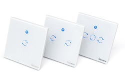
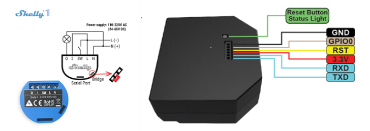

[ui-tabs position="top-left" active="0" theme="lite"]
[ui-tab title="Descripción ..."]

> **¿Qué es un interruptor inteligente?**<br />
Los interruptores WiFi al igual que los tradicionales se instalan conectándolos a la red eléctrica del interruptor convencional, pero a diferencia de los tradicionales te permiten instalar una aplicación de control en tu smartphone y con la que manejar a distancia este interruptor. **Puedes establecer un horario, apagarlo o encenderlo de forma remota.**


**Interruptores de luz inteligentes: Cosas a considerar:**
A diferencia de las luces inteligentes , los interruptores **requieren un poco más de consideración.** Puede parecer un caso de simplemente sacar tu interruptor existente e intercambiarlo por uno nuevo, **pero hay cosas que debes considerar (cableado, medidas, compatibilidad)**.
Éstos interruptores **requieren un cable de fase adicional** (normalmente color azul, dentro de tu instalación), para la alimentación del dispositivo wifi.
**También debes tener en cuenta** que éstos dispositivos, en caso de **reemplazo de los existentes**, si los existentes son conmutados, **pierdes uno de los conmutados**, cosa que no agrada demasiado.

**Otra opción, en vez de reemplazar los interruptores**, són los dispositivos **_Shelly_**, són disposivos que se instalan en las cajas de empalme de la casa,  con los cables de los interruptores existentes, por lo que **mantienes la función de los interruptores, y además, están enlazados por wifi.**. **_Shelly 1_**  (una fase) **_Shelly 2,5_** (dos Fases).



Pero los interruptores de luz inteligentes te otorgan un control inteligente sobre las luces «tontas» que ya se encuentran en tu hogar; no solo puedes encenderlas o apagarlas a miles de kilómetros de distancia, sino que también podrás ajustar el brillo y en algunos casos, el color. 

!! Si tienes algún accesorio de iluminación en tu hogar que sea incompatible con bombillas inteligentes, el interruptor que necesitas deberá ser un interruptor inteligente.

+ **Nuestro consejo es hacer un análisis coste-beneficio**. Conectar tu casa con interruptores de luz inteligentes puede ser una tarea costosa, especialmente con casas grandes. Pero la alternativa, es decir, el coste de instalar bombillas inteligentes y enchufes inteligentes en toda la casa puede resultar superior, a largo plazo.

---

[ui-accordion independent=true open=none]

[ui-accordion-item title="Sonoff Basic | Amazon » 5,81€ -  Aliexpress » 4,22€ "]

|  |  |
|:------|:-----------------------:|
| <p>[**Sonoff Basic Interruptor Inteligente ...**](https://amzn.to/2Hbfsor)</p> <p>Sonoff Basic es un interruptor inteligente WiFi que permite encender y apagar remotamente un aparato eléctrico.</p><p>- Este dispositivo eléctrico transmite datos a través de su router WiFi Permitiendo a los usuarios controlar de forma remota todos los dispositivos conectados a través de la aplicación móvil **_eWeLink_**.</p> | <div> ![img-500crop][amzn-basic] </div> <div> <a href="https://amzn.to/2Hbfsor" alt="amazon-link" target="_blank"><button type="button" style="color:#fff;background-color:#1694CA;width:100%;height:35px;"><i class="fa fa-amazon fa-lg">mazon</i></button></a> </div> <button type="button" style="color:#transparent;background-color:transparent;opacity:0.9;width:96%;height:0px;"> <div> <a href="http://s.click.aliexpress.com/e/bHRK4xVm" alt="AlieExpress-link" target="_blank"> <button type="button" style="color:#fff;background-color:#e8a100;width:100%;height:35px;"><i class="fa fa-shopping-cart  fa-lg"> AliExpress</i></button></a> </div> |

[/ui-accordion-item]

[ui-accordion-item title="Sonoff touch EU | Amazon » 21,33€ -  Aliexpress » 10,95€ "]
    
|  |  |
|:------|:-----------------------:|
| <p>[**Sonoff Smart Wi-Fi Interruptor de luz táctil ...**](https://amzn.to/2J8kDsY)</p><p>Controle sus electrodomésticos o dispositivos eléctricos en cualquier momento y en cualquier lugar.</p><p>- Donde quiera que esté y siempre que desee encender/apagar sus electrodomésticos o dispositivos eléctricos, no necesita estar allí o la ayuda de los demás, solo necesita tocar ligeramente el botón ON/OFF en la aplicación **_Ewelink_**.</p><p>Los dispositivos conectados se encenderán o apagarán automáticamente. La aplicación inteligente **_Ewelink_** es compatible con _smartphones_ o _tablets_ con _Android_ e _IOS_.</p> | <div> ![img-500crop][amzn-touch2] </div> <div> <a href="https://amzn.to/2J8kDsY" alt="amazon-link" target="_blank"><button type="button" style="color:#fff;background-color:#1694CA;width:100%;height:35px;"><i class="fa fa-amazon fa-lg">mazon</i></button></a> </div> <button type="button" style="color:#transparent;background-color:transparent;opacity:0.9;width:96%;height:0px;"> <div> <a href="http://s.click.aliexpress.com/e/ERgGkIy" alt="AlieExpress-link" target="_blank"> <button type="button" style="color:#fff;background-color:#e8a100;width:100%;height:35px;"><i class="fa fa-shopping-cart  fa-lg"> AliExpress</i></button></a> </div> |
    
[/ui-accordion-item]

[ui-accordion-item title="Sonoff 2 Gang Wifi | Amazon » 22,98 - Aliexpress » 17,71€ "]
    
|  |  |
|:------|:-----------------------:|
| <p>[**Sonoff T1 WiFi Touch 2 Gang...**](http://s.click.aliexpress.com/e/bQ01Ojfi)</p><p>**- Encendido / apagado remoto y Soporte de aplicaciones**: enciende/apaga las luces desde cualquier lugar. Aplicación móvil gratuita _iOS_ y _Android_ **_eWeLink_**.</p><p>- **Control independiente y Timers**: controla cada grupo por separado y encender/apagar a la hora especificada.</p> <p>- **Control compartido y Compatibilidad**: Controle su casa inteligente junto con su familia. Compatible con _Amazon Alexa_ y _Asistente de Google_.</p>| <div> ![img-500crop][amzn-touch1] </div> <div> <a href="https://amzn.to/2Jp3Gtp" alt="amazon-link" target="_blank"><button type="button" style="color:#fff;background-color:#1694CA;width:100%;height:35px;"><i class="fa fa-amazon fa-lg">mazon</i></button></a> </div> <button type="button" style="color:#transparent;background-color:transparent;opacity:0.9;width:96%;height:0px;"> <div> <a href="http://s.click.aliexpress.com/e/bQ01Ojfi" alt="AlieExpress-link" target="_blank"> <button type="button" style="color:#fff;background-color:#e8a100;width:100%;height:35px;"><i class="fa fa-shopping-cart  fa-lg"> AliExpress</i></button></a> </div> |

[/ui-accordion-item]

[ui-accordion-item title="Sonoff 3 Gang WiFi | Amazon » 23,75€ -  Aliexpress » 19,08€ "]

|  |  |
|:------|:-----------------------:|
| <p>[**Sonoff 3 Gang WiFi...**](http://s.click.aliexpress.com/e/LenLi2c)</p><p>Mismo dispositivo que el anterior con **3 pulsadores para controlar 3 puntos de luz** desde el mismo componente.</p><p>- **Encendido / apagado remoto y Soporte de aplicaciones**: enciende/apaga las luces desde cualquier lugar. Aplicación móvil gratuita _iOS_ y _Android_ **_eWeLink_**.</p><p>- **Control independiente y Timers**: Controla cada grupo por separado y encender/apagar a la hora especificada.</p> <p>- **Control compartido y compatibilidad**: Controle su casa inteligente junto con su familia. Compatible con _Amazon Alexa_, _Asist. de Google_, _IFTTT_.</p>| <div> ![img-500crop][amzn-touch3] </div> <div> <a href="https://amzn.to/2LE8r5o" alt="amazon-link" target="_blank"><button type="button" style="color:#fff;background-color:#1694CA;width:100%;height:35px;"><i class="fa fa-amazon fa-lg">mazon</i></button></a> </div> <button type="button" style="color:#transparent;background-color:transparent;opacity:0.9;width:96%;height:0px;"> <div> <a href="http://s.click.aliexpress.com/e/LenLi2c" alt="AlieExpress-link" target="_blank"> <button type="button" style="color:#fff;background-color:#e8a100;width:100%;height:35px;"><i class="fa fa-shopping-cart  fa-lg"> AliExpress</i></button></a> </div> |    
    
[/ui-accordion-item]

[ui-accordion-item title="Conmutador Shelly 1 | Amazon » 22,99€ "]

|  |  |
|:------|:-----------------------:|
| <p>[**Conmutador Shelly 1...**](https://amzn.to/2Lunn5V)</p><p>Transformar un hogar o una oficina en inteligente que no requiere de complejas instalaciones.</p><p>- Interruptor de relé Wi-Fi **_Shelly1_**, que con sus compactas  dimensiones 41x36x17 mm el instalador podrá acoplarlo detrás de cualquier contacto de alimentación.</p><p>- Interruptor de luz estándar o directamente en una caja de DIN en la caja de electricidad.</p> | <div> ![img-500crop][amzn-shelly1] </div> <div> <a href="https://amzn.to/2Lunn5V" alt="amazon-link" target="_blank"><button type="button" style="color:#fff;background-color:#1694CA;width:100%;height:35px;margin:5px;"><i class="fa fa-amazon fa-lg">mazon</i></button></a> </div> |

[/ui-accordion-item]

[ui-accordion-item title="Interruptor Cortina o Persianas WiFi  | Amazon » 20,99€ "]

|  |  |
|:------|:-----------------------:|
| <p>[**Interruptor Cortina o Persianas WiFi...**](https://amzn.to/2JqiQ1O)</p><p>El interruptor de cortina Wifi puede funcionar con cortinas inteligentes, puertas eléctricas, puertas de garaje inteligentes y otros aparatos. </p><p>- Se instala en tan solo unos minutos como un interruptor ciego tradicional. **Este interruptor táctil WiFi requiere conectarse con _cable neutro_**.</p><p>**Aplicación**: _eWelink_.</p> | <div> ![img-500crop][amzn-persiana] </div> <div> <a href="https://amzn.to/2JqiQ1O" alt="amazon-link" target="_blank"><button type="button" style="color:#fff;background-color:#1694CA;width:100%;height:35px;margin:5px;"><i class="fa fa-amazon fa-lg">mazon</i></button></a> </div> |

[/ui-accordion-item]

[ui-accordion-item title="Interruptor similar a Sonoff Bl/Ng | Aliexpress » 9,18€ - 12,87€ "]

|  |  |
|:-------------|:-------------:|
| <p>[**Vhome Ewelink Touch Switch,2.4G...**](http://s.click.aliexpress.com/e/bw4GpfYy)</p><p>Interruptor similar a **_Sonoff_**  de 1 a 3 Gang ...<br />3 colores diferentes: **Blanco**, **Negro** o **Crema**.<br />Aplicación **_eWelink_** y se puede integrar a _Google Home_ y a<br />_Home Assistant_.</p> | <div> ![200x200][amzn-vhome] <a href="http://s.click.aliexpress.com/e/bw4GpfYy" alt="AlieExpress-link" target="_blank"><button type="button" style="color:#fff;background-color:#e8a100;width:100%;height:35px;"><i class="fa fa-shopping-cart"> AliExpress</i></button></a> </div> |

|  |  |
|:------|:-----------------------:|
| <p>[**Vhome Ewelink Touch Switch,2.4G ...**](http://s.click.aliexpress.com/e/bw4GpfYy)</p><p>Interruptor similar a **_Sonoff_**  de 1 a 3 Gang ... 3 colores diferentes: **Blanco**, **Negro** o **Crema**.</p><p>- Aplicación **_eWelink_** y se puede integrar a _Google Home_ y a _Home Assistant_.</p><p>- Panel táctil, EU Standard, Control WiFi y también compatible con _Amazon Alexa_.</p> | <div> ![img-500crop][amzn-vhome] </div> <div> <a href="http://s.click.aliexpress.com/e/bw4GpfYy" alt="AlieExpress-link" target="_blank"> <button type="button" style="color:#fff;background-color:#e8a100;width:100;height:35px;"><i class="fa fa-shopping-cart  fa-lg"> AliExpress</i></button></a> </div> |

[/ui-accordion-item]
    
[/ui-accordion]

<!--- REFERENCIA A IMAGENES AL PIE DEl ARTÍCULO --->

[amzn-touch2]: user://pages/02.interruptores/sonoff_touch2.png?lightbox=1024&cropResize=500,500
[amzn-touch1]: user://pages/02.interruptores/touch1.png?lightbox=1024&cropResize=500,500
[amzn-basic]: user://pages/02.interruptores/basic.png?lightbox=1024&cropResize=500,500
[amzn-touch3]: user://pages/02.interruptores/sonoff_touch3.png?lightbox=1024&cropResize=500,500
[amzn-shelly1]: user://pages/02.interruptores/shelly11.png?lightbox=1024&cropResize=500,500
[amzn-persiana]: user://pages/02.interruptores/Persiana.png?lightbox=1024&cropResize=500,500
[amzn-vhome]: user://pages/02.interruptores/vhome.png?lightbox=1024&cropResize=500,500
[buy-mzn]: https://dabuttonfactory.com/button.png?t=Comprar+en+AMAZON!&f=Roboto-Bold&ts=18&tc=fff&w=200&h=40&c=5&bgt=unicolored&bgc=037ba2
[buy-aliex]: https://dabuttonfactory.com/button.png?t=Comprar+en+ALIEXPRESS!&f=Roboto-Bold&ts=16&tc=fff&w=200&h=40&c=5&bgt=unicolored&bgc=ffae00

---

[](# "Volver al Inicio")

[/ui-tab]

[ui-tab title="Integración ..."]

La **Integración en Google Home** es muy secilla, solo tienes que añadir la cuenta que creaste en la aplicacion del disposivo, en este caso sera **_eWelink_**, para los dispositivos **_Sonoff_** y **_Shelly Cloud_**, para los dispositivos **_Shelly_**, en la configuración de añadir dispositivos de _Google Home_, aquí tenéis los enlaces para descargar la que necesitéis:
 * [**eWelink android**](http://bit.ly/304iAeG)
 * [**eWelink Iphone**](https://apple.co/2VO5ZwV)    
 * [**Shelly Cloud android**](http://bit.ly/2DYDjHj)
 * [**Shelly Cloud Iphone**](https://apple.co/2WuWTCk)

###### **_(Aúnque en el Ejemplo usamos la aplicación Kasa, el procedimiento para la integración és el mismo, utilizando la aplicación correcta del componente, arriba indicada, según proceda)._**.###### 


**Para Integrarlo en Home Assitant**

+ Ejemplo configuración dispositivos **_Shelly_**  `configuration.yaml`:

```text

switch:
  - platform: rest
    name: "Shelly2 Switch1"
    scan_interval: 5
    resource: http://192.168.0.28/relay/0    (IP de nuestro Shelly1)
    body_on: 'turn=on'
    body_off: 'turn=off'
    is_on_template: '{{ value_json.ison == true}}'
    headers:
      content-type: application/x-www-form-urlencoded

```
+ Ejemplo configuración dispositivos **_Sonoff_**  `configuration.yaml`:

```text

sonoff:
  username: nuestrocorreo@correo.es
  password: nuestracontraseña
  scan_interval: 60
  grace_period: 600
  api_region: 'eu'

```
!! _"En el caso de la configuración de los disposivos **Sonoff**, la aplicación **eWelink**, **no permite estar abierta en dos aplicaciones al mismo tiempo** así que, recomiendo que abras otra cuenta de correo, solo para Home Assistant, y que désde la cuenta principal del móvil, compartas los dispositivos a la cuenta de correo de Home Assistant, de ésta manera podrá estar abierta en las dos aplicaciones a la vez."_
---

[/ui-tab]

[/ui-tabs]