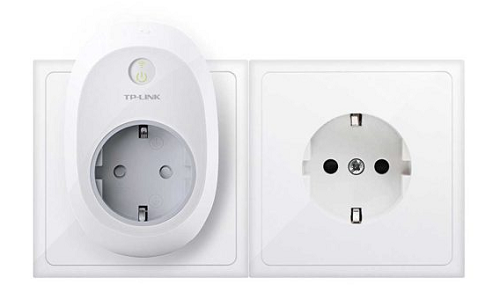

TP-Link cuenta con dos modelos con WiFi, el HS100 y el HS110. Ambos cuentan con las mismas funciones de control mediante la aplicación, programación, modo de simulación de que hay gente en casa, etc. Sin embargo, el HS110 también mide el consumo energético de los aparatos que le conectamos, y saca resúmenes semanas y mensuales. Podemos controlarlo con la voz con Google Home

Para controlar ambos hay que descargar la aplicación Kasa para iOS y Android. El HS100 vale 19,99 euros, y el HS110 vale 27,99 euros. Ambos funcionan por WiFi de 2,4 GHz, se pueden controlar desde fuera de casa, y tienen garantía de 3 años.

Amazon: [TP-Link HS100 19,99€](https://amzn.to/2Lj7sHB) __ [TP-Link HS110  27.99€](https://amzn.to/2LjHwve) 

!!!! Lorem ipsum dolor sit amet, **consectetur adipiscing** elit.

[ui-accordion independent=true open=all]
[ui-accordion-item title="TP-Link HS100"]
|  |  |
|:-------------|:-------------:|
| 
[**TP-Link HS100 - Enchufe inteligente para controlar sus dispositivos  desde cualquier lugar, sin necesidad de concentrador ...**](https://amzn.to/2Lj7sHB)

- **Acceso remoto**: Controla dispositivos conectados al Enchufe Inteligente donde tengas Internet, utilizando la app gratuita Kasa en tu smartphone.

- **Programación:** Programa el Enchufe Inteligente para que automáticamente encienda o apague la alimentación de los  electrodomésticos según sea necesario: **Encender la luz al  anochecer o apagarla al amanecer** ...
 | ![200x200][amzn-TPL-HS100] [![buy-mzn!][buy-mzn]](https://amzn.to/2Lj7sHB)
 |
[ui-accordion-item title="TP-Link HS110"]
|  |  |
|:-------------|:-------------:|
| 
[**TP-Link HS110 - TP-Link HS110 - Enchufe inteligente inalámbrico  con monitorización de energía desde cualquier lugar ...**](https://amzn.to/2Lj7sHB)

**- Monitorización de energía**: Analiza el consumo de potencia a tiempo real e histórico de un dispositivo. - **Acceso remoto**: Controla dispositivos conectados al Enchufe Inteligente donde tengas Internet, utilizando la app gratuita Kasa en tu smartphone. - **Programación:** Programa el Enchufe Inteligente para que automáticamente encienda o apague la alimentación de los  electrodomésticos según sea necesario: **Encender la luz al  anochecer o apagarla al amanecer** ...
 | ![200x200][amzn-TPL-HS110] [![buy-mzn!][buy-mzn]](https://amzn.to/2LjHwve)
 |
[/ui-accordion-item]
[/ui-accordion]

<!--- REFERENCIA A IMAGENES AL PIE DEl ARTÍCULO --->

[mejor-oferta]: https://dabuttonfactory.com/button.png?t=Mejor+oferta!&f=Roboto-Bold&ts=24&tc=fff&w=200&h=50&c=5&bgt=unicolored&bgc=e4b101?classes=float-left
[amzn-TPL-HS100]: https://dummyimage.com/200x200/474/fff.png&text=200x200
[amzn-TPL-HS110]: https://dummyimage.com/200x200/474/fff.png&text=200x200
[amzn-btn-lnk]: https://images-na.ssl-images-amazon.com/images/G/01/associates/remote-buy-box/buy1.gif "TP-Link-HS100"
[buy-mzn]: https://dabuttonfactory.com/button.png?t=Buy+from+AMAZON!&f=Roboto-Bold&ts=20&tc=fff&w=200&h=40&c=5&bgt=unicolored&bgc=037ba2 "TP-Link-HS100"