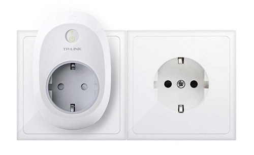

[ui-tabs position="top-left" active="0" theme="lite"]
[ui-tab title="Descripción ..."]

TP-Link cuenta con dos modelos con WiFi, el _HS100_ y el _HS110_. Ambos cuentan con las mismas funciones de control mediante la aplicación, programación, modo de simulación de que hay gente en casa... etc. Sin embargo, el _HS110_ también mide el consumo energético de los aparatos que le conectamos, y saca resúmenes semanales y mensuales. Podemos controlarlos con la voz con **Google Home**.

Para controlar ambos hay que descargar la aplicación Kasa para [iOS](https://apple.co/2WveAlg) o [Android](http://bit.ly/2YgEx8L). El HS100 vale 19,99 euros, y el HS110 vale 27,99 euros. Ambos funcionan por WiFi de 2,4 GHz, se pueden controlar desde fuera de casa, y tienen garantía de 3 años.

---

[/ui-tab]

[ui-tab title="Componentes ..."]

[ui-accordion independent=true open=all]

[ui-accordion-item title="TP-Link HS100 | Amazon » 19,90€"]

|  |  |
|:------|:-----------------------:|
| <p>[**TP-Link HS100 - Enchufe inteligente para controlar sus dispositivos desde cualquier lugar ...**](https://amzn.to/2Lj7sHB)</p><p>- **Acceso remoto**: Controla dispositivos conectados al Enchufe Inteligente donde tengas Internet, utilizando la app gratuita **Kasa** en tu smartphone.</p><p>- **Programación:** Programa el Enchufe Inteligente para que automáticamente encienda o apague la alimentación de los electrodomésticos según sea necesario: **Encender la luz al anochecer o apagarla al amanecer** ...</p> | <div> ![img-500crop][amzn-TPL-HS100] </div> <div> <a href="https://amzn.to/2Lj7sHB" alt="amazon-link" target="_blank"><button type="button" style="color:#fff;background-color:#1694CA;width:100%;height:35px;margin:5px;"><i class="fa fa-amazon fa-lg">mazon</i></button></a> </div> |

[/ui-accordion-item]

[ui-accordion-item title="TP-Link HS110 | Amazon » 27.99€"]

|  |  |
|:------|:-----------------------:|
| <p>[**TP-Link HS110 - Enchufe inteligente para controlar sus dispositivos desde cualquier lugar ...**](https://amzn.to/2HjWRab)</p><p>- **Monitorización de energía**: Analiza el consumo de potencia a tiempo real e histórico de un dispositivo.</p><p>- **Acceso remoto**: Controla dispositivos conectados al Enchufe Inteligente donde tengas Internet, utilizando la app gratuita **Kasa** en tu smartphone.</p><p>**- Programación:** Programa el Enchufe Inteligente para que automáticamente encienda o apague la alimentación de los electrodomésticos según sea necesario: **Encender la luz al anochecer o apagarla al amanecer** ...</p> | <div> ![img-500crop][amzn-TPL-HS110] </div> <div> <a href="https://amzn.to/2HjWRab" alt="amazon-link" target="_blank"><button type="button" style="color:#fff;background-color:#1694CA;width:100%;height:35px;margin:5px;"><i class="fa fa-amazon fa-lg">mazon</i></button></a> </div> |

[/ui-accordion-item]

[/ui-accordion]

<!--- REFERENCIA A IMAGENES AL PIE DEL ARTÍCULO --->

[amzn-TPL-HS100]: user:/pages/03.enchufes-Inteligentes/01.tp-link-hs100-hs110/tp-link-hs-100.png?lightbox=1024&cropResize=500,500
[amzn-TPL-HS110]: user://pages/03.enchufes-Inteligentes/01.tp-link-hs100-hs110/tp-link-hs-110.png?lightbox=1024&cropResize=500,500
[int-ghome]: user://pages/02.interruptores/integracion_google_home.gif
[up1_azul1]: user://pages/01.introduccion-al-blog/01.home-assistant/integracion-telegram/up1_azul1.png
---


[/ui-tab]

[ui-tab title="Integración ..."]

La **Integración en Google Home** es muy secilla, solo tienes que añadir la cuenta que creas de la aplicacion del disposivo en la configuracion de añadir dispositivos de Google Home:
![int-ghome]
**Para Integrarlo en Home Assitant**


+ Ejemplo `configuration.yaml` entradas con IP's específicas:

```text
tplink:
  discovery: false
  light:
    - host: 192.168.200.1
    - host: 192.168.200.2
  switch:
    - host: 192.168.200.3
    - host: 192.168.200.4
```
---

[/ui-tab]

[/ui-tabs]

[![up1_azul1]](# "Volver al Inicio")
