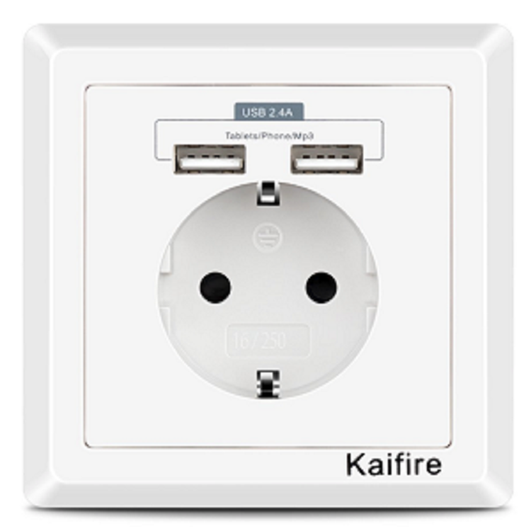

[ui-tabs position="top-left" active="0" theme="lite"]
[ui-tab title="Descripción ..."]

!!! Para la elección adecuada de las tomas de corriente, **tendrás que  tener en cuenta el consumo de los electrodomésticos que vayas a conectar**, existen tomas de hasta 10A y tomas de 15A y 16A.

+ Toma de corriente de protección, con 2 conectores **USB tipo A**. Conexiones con cable de hasta 2,5 mm².
+ Protección con protección infantil integrada.
+ Uso simultáneo de todos los puertos,USB a 2.4A.
+ Para la carga sin complicaciones de todos los dispositivos móviles que tienen una interfaz USB, como por ejemplo _iPhone(s)_, _iPad(s)_ y teléfonos inteligentes _Android_.
+ **La carga máxima de los dos puertos USB es de 2.4A**

La toma suele estar protegida electrónicamente contra **cortocircuitos**, **sobrecargas** y una función de **filtro de línea**.


---

[ui-accordion independent=true open=none]

[ui-accordion-item title="Kaifire USB Enchufe Pared 2.4A Schuko | Amazon » 13,99€"]
|  |  |
|:-------------|:-------------:|
| <p>[**Kaifire USB Enchufe Pared 2.4A Schuko<br/> Toma de Corriente Estándar<br/> con 2 USB Conectores...**](https://amzn.to/2HqTtKl)</p><p>- **Acceso remoto**: Controla dispositivos conectados al Enchufe<br/>inteligente donde tengas Internet, utilizando la app gratuita<br/> **SmartLife** en tu smartphone.<br/>- **Programación:** Programa el Enchufe inteligente para que<br/>automáticamente encienda o apague la alimentación de los<br/> electrodomésticos según sea necesario.</p> | <div> ![200x200][amzn-Kaifire] <a href="https://amzn.to/2HqTtKl" alt="amazon-link" target="_blank"><button type="button" style="color:#fff;background-color:#1694CA;width:100%;height:35px;"><i class="fa fa-amazon">mazon</i></button></a> </div> |
[/ui-accordion-item]

[ui-accordion-item title="Jindia 2.4A Schuko Enchufe Pared | Amazon » 13,49€"]
|  |  |
|:-------------|:-------------:|
| <p>[**Jindia 2.4A Schuko Enchufe para la pared 2 puertos de carga<br/>USB, Blanco/Gris...**](https://amzn.to/2LIBu7T)</p><p>- **Acceso remoto**: Toma de contacto utilizando la app. gratuita<br/>**SmartLife** con protección infantil integrada.<br/>- Uso simultáneo de todos los puertos, USB para la carga sin<br/>complicaciones de todos los dispositivos móviles<br/>que tienen una interfaz USB, como por ejemplo _iPhones_,_iPads_,<br/>_tablets_ y teléfonos inteligentes.<br/>- La carga máxima de los dos puertos USB es de 2.4A.</p> | <div> ![200x200][amzn-Jindia] <a href="https://amzn.to/2LIBu7T" alt="amazon-link" target="_blank"><button type="button" style="color:#fff;background-color:#1694CA;width:100%;height:35px;"><i class="fa fa-amazon">mazon</i></button></a> </div> |

[/ui-accordion-item]

[ui-accordion-item title="Toma corriente 15A UE 2 puertos USB | Aliexpress » 18,71€"]
|  |  |
|:-------------|:-------------:|
| <p>[**Toma Schuko Enchufe Pared 15A 2 puertos de carga USB,<br />Blanco**](http://s.click.aliexpress.com/e/86Y7JIs)</p><p>- **Acceso remoto**: Toma de corriente con protección infantil<br />integrada 15A. Uso simultáneo de todos los puertos USB<br/>para la carga sin complicaciones de todos<br/> los dispositivos móviles que tienen una interfaz<br/> USB, como por ejemplo iPhones,<br/> iPads y teléfonos inteligentes.<br/>La carga máxima de los dos puertos USB<br/> es de 2.4A...</p> | <div> ![200x200][amzn-shukowifi] <a href="http://s.click.aliexpress.com/e/86Y7JIs" alt="AlieExpress-link" target="_blank"><button type="button" style="color:#fff;background-color:#e8a100;width:100%;height:35px;"><i class="fa fa-shopping-cart"> AliExpress</i></button></a> </div> |
[/ui-accordion-item]
[/ui-accordion]

<!--- REFERENCIA A IMAGENES AL PIE DEl ARTÍCULO --->

[amzn-Kaifire]: user:/pages/03.enchufes-Inteligentes/03.enchufes-empotrables/Kaifire.png?lightbox=1024&cropResize=200,200
[amzn-Jindia]: user://pages/03.enchufes-Inteligentes/03.enchufes-empotrables/Jindia.png?lightbox=1024&cropResize=200,200
[amzn-shukowifi]: user://pages/03.enchufes-Inteligentes/03.enchufes-empotrables/shukowifi.png?lightbox=1024&cropResize=200,200

---

[](# "Volver al Inicio")

[/ui-tab]

[ui-tab title="Integración ..."]

La **Integración en Google Home** es muy secilla, solo tienes que añadir la cuenta que creas de la aplicacion del disposivo, en este caso sera **_Smart Life_**  o  **_Tuya_**,  en la configuración de añadir dispositivos de _Google Home_, aquí tenéis el enlace para descargarlo:
 * [**Smart Life android**](http://bit.ly/2JnEUtN)
 * [**Smart Life Iphone**](https://apple.co/2DVyRsK)
 * [**Tuya Android**](http://bit.ly/2ZYql5T)
 * [**Tuya iphone**](https://apple.co/2vIrNeD)

###### **_(Aúnque en el Ejemplo usamos la aplicación Kasa, el procedimiento para la integración és el mismo, utilizando la aplicación correcta del componente, arriba indicada, según proceda)._**.###### 


**Para Integrarlo en Home Assitant:**<br/>
-Solo necesitarás anadir a tu `configuration.yaml` los siguientes datos:

+ Ejemplo  App Tuya `configuration.yaml`:

```text

tuya:
  username: nuestro@correo.es
  password: contraseñaquepusimos
  country_code: 34 

```
+ Ejemplo  App Smart Life `configuration.yaml`:

```text
​
tuya:
  username: nuestro@correo.es
  password: contraseñaquepusimos
  country_code: 34
  platform: smart_life
​
```
---

[/ui-tab]

[/ui-tabs]