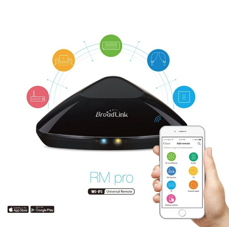

### Broadlink RM pro WIFI + IR + Control Remoto RF

* ¿Cansado de que todo tu mundo dependa de numerosos mandos a distancia? Si miras a tu alrededor posiblemente encuentres numerosos electrodomésticos en tu hogar, tienen uno, lo cual no hace más que complicar las cosas.

Pues bien, ahora el `Broadlink RM pro WIFI + IR + Control Remoto RF` es un dispositivo nuevo que ha venido a facilitarte la vida. Y es una novedad asombrosa que ya puedes comprar en _Amazon_ o _Aliexpress_.

* Televisores, aires acondicionados, ventanas, reproductores de música y reproductores de DVD funcionan mediante mandos a distancia. Para facilitar su uso a veces se usan versiones universales, aunque estas no son siempre compatibles con todos los electrodomésticos del hogar. Pero esto cambia definitivamente con esta novedad de la electrónica.

---
