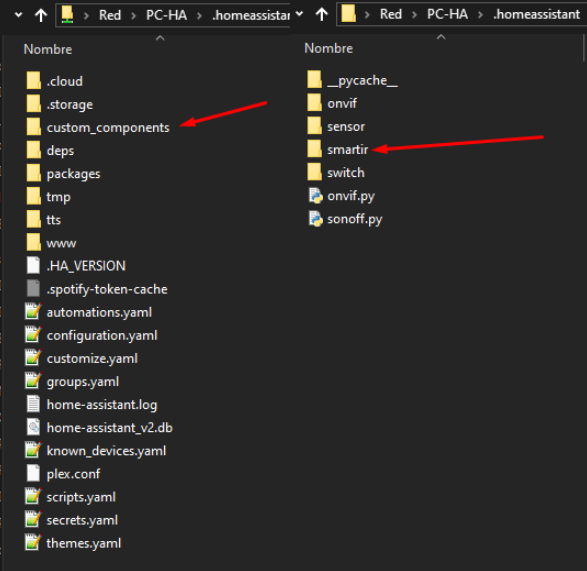

[ui-tabs position="top-left" active="0" theme="lite"]
[ui-tab title="Descripción ..."]

> ¿Cansado de que todo tu mundo dependa de numerosos mandos a distancia? Si miras a tu alrededor posiblemente encuentres numerosos electrodomésticos en tu hogar, tienen uno, lo cual no hace más que complicar las cosas ...

Pues bien, ahora el `Broadlink RM pro WIFI + IR + Control Remoto RF` es un dispositivo nuevo que ha venido a facilitarte la vida. Y es una novedad asombrosa que ya puedes comprar en _Amazon_ o _Aliexpress_.

Televisores, aires acondicionados, ventanas, reproductores de música y reproductores de DVD funcionan mediante mandos a distancia. Para facilitar su uso a veces se usan versiones universales, aunque estas no son siempre compatibles con todos los electrodomésticos del hogar. Pero esto cambia definitivamente con esta novedad de la electrónica.

---

[ui-accordion independent=true open=none]

[ui-accordion-item title="Broadlink RM pro | _Amazon_:39,89€  _Aliexpress_: 34,33€ "]
|  |  |
|:-------------|:-------------:|
| <p>[**BroadLink RM Pro+ WiFi Smart Home...**](https://amzn.to/2Lskans)</p><p>Automatización Todo en uno<br /> Aprendizaje Controlador Remoto Universal<br /> Compatible para Dispositivos iOS/Android<br /> (EU Standard)</p><p> | ![200x200][amzn-BL-RMPRO] [![buy-mzn!][buy-mzn]](https://amzn.to/2Lskans)</p>[![buy-aliex][buy-aliex]](http://bit.ly/2PQfo1q)</p> | |
[/ui-accordion-item]

[ui-accordion-item title="Broadlink RM Mini3 | » 19.99€"]
|  |  |
|:-------------|:-------------:|
| <p>[**Broadlink RM Mini3...**](https://amzn.to/2WtK7DW)</p><p>-Wi-Fi Universal Remote integra todos tus<br />dispositivos controlados IR-<br />En comparación con RMPRO,<br />no dispone la función de RF 433 Mhz.<br /> Con la aplicación IHC en tu<br />teléfono inteligente puedes controlar<br />todos los dispositivos,<br /> usa un cable USB para conectar con la<br />energía.<br /> Fácil configuración.</p> | ![200x200][amzn-BL-RMMINI3] [![buy-mzn!][buy-mzn]](https://amzn.to/2WtK7DW)</p>[![buy-aliex][buy-aliex]](http://bit.ly/2V1LpVr)</p> |
[/ui-accordion-item]

[/ui-accordion]

<!--- REFERENCIA A IMAGENES AL PIE DEl ARTÍCULO --->

[amzn-BL-RMPRO]: user://pages/04.broadlink+rm+pro/rm_pro.png?lightbox=1024&cropResize=200,200
[amzn-BL-RMMINI3]: user://pages/04.broadlink+rm+pro/rm_mini_3.png?lightbox=1024&cropResize=200,200
[buy-mzn]: https://dabuttonfactory.com/button.png?t=Comprar+en+AMAZON!&f=Roboto-Bold&ts=18&tc=fff&w=200&h=40&c=5&bgt=unicolored&bgc=037ba2
[buy-aliex]: https://dabuttonfactory.com/button.png?t=Comprar+en+ALIEXPRESS!&f=Roboto-Bold&ts=16&tc=fff&w=200&h=40&c=5&bgt=unicolored&bgc=ffae00

---

[/ui-tab]

[ui-tab title="Integración ..."]

La **Integración en Google Home** es muy secilla, solo tienes que añadir la cuenta que creas de la aplicacion del disposivo, en este caso sera IHC,  en la configuración de añadir dispositivos de _Google Home_, en éste caso concreto la aplicación de _Android_ que a mí me funcionó correctamente es la que se descarga de su página oficial, la que se baja de _Google Play_ no me funcionó correctamente, aquí tenéis el enlace para descargarlo:
 * [**IHC android**](http://bit.ly/2VMG34J)
 * [**IHC Iphone**](https://apple.co/2H80XBN)


**Para Integrarlo en Home Assitant**

Necesitaras la carpeta de `custom_components` con los archivos para los diferentes componentes, que puedes descargar de aquí: [smartir.zip](smartir.zip), la tienes que poner en el directorio de Home Assistant dentro la carpeta `custom_components`, si no la tienes debes crearla.



+ Ejemplo `configuration.yaml`:

```text

smartir:

switch:
  - platform: broadlink
    host: 192.168.1.25 _(Ip de tu Broadlink)_
    mac: 78:0f:77:eb:4c:08 _(Mac de tu broadlink)_
    
media_player:
  - platform: smartir
    name: TV Samsumg
    device_code: 1060
    controller_send_service: switch.broadlink_send_packet_192_168_1_25
    power_sensor: binary_sensor.tv_power
    
```
---

[/ui-tab]

[/ui-tabs]
