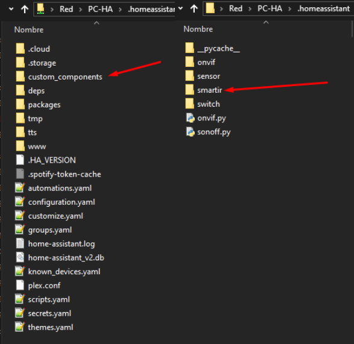

[ui-tabs position="top-left" active="0" theme="lite"]
[ui-tab title="Descripción ..."]

!!! **¿Cansado de que todo tu mundo dependa de numerosos mandos a distancia?** Si miras a tu alrededor posiblemente encuentres numerosos electrodomésticos en tu hogar, tienen uno, lo cual no hace más que complicar las cosas ...

Pues bien, ahora el `Broadlink RM pro WIFI + IR + Control Remoto RF` es un dispositivo nuevo que ha venido a facilitarte la vida. Y es una novedad asombrosa que ya puedes comprar en _Amazon_ o _Aliexpress_.

+ Televisores, aparatos de aire acondicionado, ventanas, reproductores de música y DVD funcionan mediante mandos a distancia. Para facilitar su uso a veces se usan versiones universales, aunque estas no son siempre compatibles con todos los electrodomésticos del hogar. **Pero esto cambia definitivamente con esta novedad de la electrónica ...**

---

[/ui-tab]

[ui-tab title="Componentes ..."]

[ui-accordion independent=true open=all]

[ui-accordion-item title="Broadlink RM pro | Amazon » 39,89€ - Aliexpress » 34,35€ "]

|  |  |
|:------|:-----------------------:|
| <p>[**BroadLink RM Pro+ WiFi Smart Home ...**](https://amzn.to/2Lskans)</p><p>- Automatización Todo en uno, Aprendizaje, Controlador Remoto Universal. Señal IR/RF estable y confiable, integra todos tus dispositivos controlados por IR (38kHz) y RF(433 MHz) en una sola aplicación en tu PC o _smartphone_.</p><p>Crea actividades personalizadas para controlar, de forma remota, tus equipo multimedia solo usando tu teléfono inteligente.</p><p>Puedes hacerlo desde cualquier lugar con la _AppIHC_ (Intelligent Home Center) con iOS o algunos dispositivos Android, reemplazando todos tus controles remotos dedicados. Compatible para Dispositivos iOS/Android. EU Standard.</p> | <div> ![img-500crop][amzn-BL-RMPRO] </div> <div> <a href="https://amzn.to/2Lskans" alt="amazon-link" target="_blank"><button type="button" style="color:#fff;background-color:#1694CA;width:100%;height:35px;"><i class="fa fa-amazon fa-lg">mazon</i></button></a> </div> <button type="button" style="color:#transparent;background-color:transparent;opacity:0.9;width:96%;height:0px;"> <div> <a href="http://bit.ly/2PQfo1q" alt="AlieExpress-link" target="_blank"> <button type="button" style="color:#fff;background-color:#e8a100;width:100%;height:35px;"><i class="fa fa-shopping-cart  fa-lg"> AliExpress</i></button></a> </div> |

[/ui-accordion-item]

[ui-accordion-item title="Broadlink RM Mini3 | Amazon » 19.99€ - Aliexpress » 17,13€ "]
   
|  |  |
|:------|:-----------------------:|
| <p>[**Broadlink RM Mini3 ...**](https://amzn.to/2WtK7DW)</p><p>Wi-Fi Universal Remote integra todos tus dispositivos controlados IR. En comparación con _RM Pro_, no dispone de la función RF 433 Mhz.</p><p>Con la aplicación IHC en tu teléfono inteligente puedes controlar todos los dispositivos. Usa un cable USB para conectar con la energía. Fácil configuración.</p> | <div> ![img-500crop][amzn-BL-RMMINI3] </div> <div> <a href="https://amzn.to/2WtK7DW" alt="amazon-link" target="_blank"><button type="button" style="color:#fff;background-color:#1694CA;width:100%;height:35px;"><i class="fa fa-amazon fa-lg">mazon</i></button></a> </div> <button type="button" style="color:#transparent;background-color:transparent;opacity:0.9;width:96%;height:0px;"> <div> <a href="http://bit.ly/2V1LpVr" alt="AlieExpress-link" target="_blank"> <button type="button" style="color:#fff;background-color:#e8a100;width:100%;height:35px;"><i class="fa fa-shopping-cart  fa-lg"> AliExpress</i></button></a> </div> |    
    
    
[/ui-accordion-item]

[/ui-accordion]

<!--- REFERENCIA A IMAGENES AL PIE DEl ARTÍCULO --->

[amzn-BL-RMPRO]: user:/pages/04.broadlink-rm-pro/rm_pro.png?lightbox=1024&cropResize=500,500
[amzn-BL-RMMINI3]: user://pages/04.broadlink-rm-pro/rm_mini_3.png?lightbox=1024&cropResize=500,500
[up1_azul1]: user://pages/01.introduccion-al-blog/01.home-assistant/integracion-telegram/up1_azul1.png
[int-ghome]: user://pages/02.interruptores/integracion_google_home.gif
---


[/ui-tab]

[ui-tab title="Integración ..."]

La **Integración en Google Home** es muy secilla, solo tienes que añadir la cuenta que creas de la aplicacion del disposivo, en este caso sera IHC,  en la configuración de añadir dispositivos de _Google Home_, en éste caso concreto la aplicación de _Android_ que a mí me funcionó correctamente es la que se descarga de su página oficial, la que se baja de _Google Play_ no me funcionó correctamente, aquí tenéis el enlace para descargarlo:
 * [**IHC android**](http://bit.ly/2VMG34J)
 * [**IHC Iphone**](https://apple.co/2H80XBN)

###### **_(Aúnque en el Ejemplo usamos la aplicación Kasa, el procedimiento para la integración és el mismo, utilizando la aplicación correcta del componente, arriba indicada, según proceda)._**.###### 
![int-ghome]

**Para Integrarlo en Home Assitant**

Necesitaras la carpeta de `custom_components` con los archivos para los diferentes componentes, que puedes descargar de aquí: [smartir.zip](smartir.zip), la tienes que poner en el directorio de Home Assistant dentro la carpeta `custom_components`, si no la tienes debes crearla.



+ Ejemplo `configuration.yaml`:

```text

smartir:

switch:
  - platform: broadlink
    host: 192.168.1.25 _(Ip de tu Broadlink)_
    mac: 78:0f:77:eb:4c:08 _(Mac de tu broadlink)_
    
media_player:
  - platform: smartir
    name: TV Samsumg
    device_code: 1060
    controller_send_service: switch.broadlink_send_packet_192_168_1_25
    power_sensor: binary_sensor.tv_power
    
```
---

[/ui-tab]

[/ui-tabs]

[![up1_azul1]](# "Volver al Inicio")