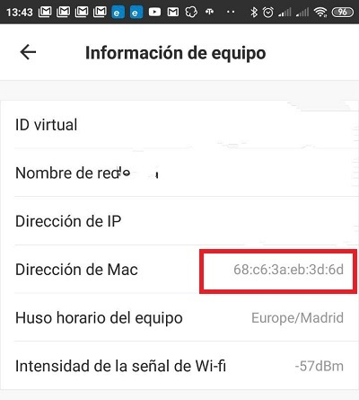

[ui-tabs position="top-left" active="0" theme="lite"]
[ui-tab title="Descripción ..."]

> Comprar un termostato WiFi es **una de las mejores cosas que puedes hacer** para ahorrar en la factura de la luz, en el caso que tengas calefacción en casa. Lejos de ser una pijada para geeks y techies, los termostatos inteligentes han demostrado ser, como mínimo,  **un 24% más eficientes que los termostatos analógicos**. Y tal y como está el precio de la luz, no es cosa menor.

Pero instalar un termostato WiFi en casa no solo es buena idea por el ahorro energético, sino por confort. La regulación automática de la temperatura, el control a distancia desde tu propio móvil allí donde estés, y la posibilidad de monitorizar el consumo son prestaciones que los termostatos inteligentes ofrecen, mientras que los termostatos normales no.

Los termostatos WiFi son también una herramienta más para domotizar tu hogar y hacerlo inteligente.

Tenemos modelos cono los _Nest_, _Netnamo_, _Tado_ ... Son termostatos de alta gama que funcionan perfectamente, pero son bastante caros! Dispones de modelos mas asequibles que también realizan su función perfectamente como: _Fluoreon_, _Beok_ y _Walmeech_ y están disponibles en _Amazon_.

---

[ui-accordion independent=true open=none]

[ui-accordion-item title="Netatmo | Amazon » 164,95€ "]
|  |  |
|:-------------|:-------------:|
| <p>[**Netatmo.Termostato Inteligente para caldera individual...**](https://amzn.to/2H27FcP)</p><p>Termostato Inteligente Netatmo te permite<br />**ahorrar una media de 37% de energÍa** para<br /> calentar tu casa. El ahorro se consigue gracias <br />a una programa de la calefacción adaptada <br />a tu ritmo de vida, al control<br /> fácil de la calefacción desde tu smartphone<br /> y a los consejos personalizados<br /> de tu Balance de Ahorro Energético.</p><p> | ![200x200][amzn-netnamo][![buy-mzn!][buy-mzn]](https://amzn.to/2H27FcP)</p> |
[/ui-accordion-item]

[ui-accordion-item title="Nest | Amazon » 249,00€ "]
|  |  |
|:-------------|:-------------:|
| <p>[**Nest Learning  -  Termostato Inteligente de 3A, Negro...**](https://amzn.to/2JsD7DA)</p><p>El **Nest Learning thermostat** de tercera<br /> generación es delgado, elegante y refinado.<br /> La Grande y clara pantalla y lectura<br /> a distancia te permiten ver **temperatura, hora y<br /> predicción meteorológica** <br />incluso cuando te vayas de la otra parte <br />de la habitación. El termostato Nest<br /> aprende la temperatura que desees para luego<br />  programarse.<br /> Conoce el tiempo necesario para calentar tu casa y te<br /> preparará para tú llegada.<br /> **Cuando te vayas se apagará, para <br />permitirte ahorrar energía**. <br />De más, con la aplicación Nest,<br /> podrás cambiar la temperatura o controlar<br /> la historial de energía donde <br />quiera que vayas.</p> | ![200x200][amzn-Nest] [![buy-mzn!][buy-mzn]](https://amzn.to/2JsD7DA)</p> |
[/ui-accordion-item]

[ui-accordion-item title="Beok BOT-313 WiFi | Amazon » 38,99€ "]
|  |  |
|:-------------|:-------------:|
| <p>[**Beok BOT-313 WiFi termostato se puede controlar por<br /> APP...**](https://amzn.to/2Jicz8e)</p><p>El **termostato WiFi** es **la nueva forma inteligente<br /> de controlar la temperatura en su hogar**<br /> y reducir fácilmente el costo <br />de calefacción de su caldera de gas.<br /> El termostato BOT313WIFI le permite sentirse<br /> cómodo sabiendo que la temperatura de su <br />hogar siempre será como le gusta.<br /> Es **fácil de instalar** y usar y se adapta <br />convenientemente a su estilo de vida.<br /> Puede programarlo según su horario, <br />o dejar que se adapte a su vida a<br /> medida que cambian los planes.<br /> Controle este termostato inteligente <br />desde cualquier lugar simplemente<br />usando su teléfono inteligente: <br />ayudando a mantener la vida simple, <br />mientras que asegura la máxima<br /> comodidad cuando está en casa<br /> y **ahorrando dinero en sus facturas<br /> de energía.**</p> | ![200x200][amzn-Beok] [![buy-mzn!][buy-mzn]](https://amzn.to/2Jicz8e)</p> |
[/ui-accordion-item]

[ui-accordion-item title="Floureon Termostato para de caldera de gas | Amazon » 69,99€ "]
|  |  |
|:-------------|:-------------:|
| <p>[**Floureon Termostato Caldera gas con Wifi 3A...**](https://amzn.to/2Vl5Z7Z)</p><p>Termostato hidráulico con pantalla<br /> con retroiluminación LCD Control<br /> con App Compatible con Google Home, <br />Color blanco<br />El **termostato WiFi** es **la nueva forma inteligente<br /> de controlar la temperatura en su hogar** y<br /> reducir fácilmente el costo <br />de calefacción de su caldera de gas.<br />**Ahorrando dinero en sus facturas de<br /> energía.**</p> | ![200x200][amzn-Floureon] [![buy-mzn!][buy-mzn]](https://amzn.to/2Vl5Z7Z)</p> |
[/ui-accordion-item]

[ui-accordion-item title="Decdeal 3A Termostato Calefacción Agua | Amazon » 39,99€ "]
|  |  |
|:-------------|:-------------:|
| <p>[**Decdeal 3A Termostato Programable<br /> de Calefacción por Agua,Control de Voz.**](https://amzn.to/2DU5iIe)</p><p>Este termostato de calefacción está <br />diseñado como un controlador de<br /> temperatura de calentamiento del agua de la caldera. <br />Es adecuado para su uso en edificios de<br /> oficinas, hospitales, escuelas<br /> y lugares de entretenimiento para<br /> el control de la temperatura.</p> | ![200x200][amzn-Decdeal] [![buy-mzn!][buy-mzn]](https://amzn.to/2DU5iIe)</p> |
[/ui-accordion-item]


[/ui-accordion]

<!--- REFERENCIA A IMAGENES AL PIE DEl ARTÍCULO --->

[amzn-netnamo]: user://pages/05.termostatos-calefaccion/netnamo.png?lightbox=1024&cropResize=200,200
[amzn-Nest]: user://pages/05.termostatos-calefaccion/nest.png?lightbox=1024&cropResize=200,200
[amzn-Beok]: user://pages/05.termostatos-calefaccion/Beok.png?lightbox=1024&cropResize=200,200
[amzn-Floureon]: user://pages/05.termostatos-calefaccion/Floureon.png?lightbox=1024&cropResize=200,200
[amzn-Decdeal]: user://pages/05.termostatos-calefaccion/decdeal.png?lightbox=1024&cropResize=200,200
[buy-mzn]: https://dabuttonfactory.com/button.png?t=Comprar+en+AMAZON!&f=Roboto-Bold&ts=18&tc=fff&w=200&h=40&c=5&bgt=unicolored&bgc=037ba2
[buy-aliex]: https://dabuttonfactory.com/button.png?t=Comprar+en+ALIEXPRESS!&f=Roboto-Bold&ts=16&tc=fff&w=200&h=40&c=5&bgt=unicolored&bgc=ffae00

---

[/ui-tab]

[ui-tab title="Integración ..."]

La **Integración en Google Home** es muy secilla, solo tienes que añadir la cuenta que creas de la aplicacion del disposivo, en este caso sera **_BeokHome_**,  en la configuración de añadir dispositivos de _Google Home_, aquí tenéis el enlace para descargarlo:
 * [**BeokHome android**](http://bit.ly/2H4huqE)
 * [**BeokHome Iphone**](https://apple.co/2PTiGRF)

###### **_(Aúnque en el Ejemplo usamos la aplicación Kasa, el procedimiento para la integración és el mismo, utilizando la aplicación correcta del componente, arriba indicada, según proceda)._**.###### 


**Para Integrarlo en Home Assitant**

Este procedimiento, aunque sólo lo he probado con el Beok BOT-313Wifi , en principio funciona para las marcas BEOK , FLOUREON, DECDEAL ya que comparten el mismo hardware.

**PASOS PREVIOS – no indicados en este tutorial**
1. Tener instalado y operativo el termostato , por supuesto conectado a la wifi.
2. Darle una ip fija al termostato ( en el ejemplo será 192.168.0.110 ) . Yo las asigno en el router
3. Conocer la MAC del termostato . En la pantalla de la app móvil te lo indica. ( para el ejemplo será 34:ea:34:xx:yy:zz )
4. Acceso a ficheros Home Assistant


Lo primero indicar que Home Assistant no soporta oficialmente los termostatos BEOK, por lo que tenemos que utilizar los `custom_components`.

1.Copiar el fichero python ( extension .py) en \custom_components\climate
En el directorio donde tienes el configuration.yaml crea una carpeta ( si no la tienes ya creada) que se llame custom_components , dentro de ella una que se llame climate , en ella tendrás que pegar el fichero broadlinkHysen.py, puedes descargarlo de [aquí](http://bit.ly/2LsjpL5)( aunque tienes que cambiarle la extension de `.yaml` a `.py`)

2. Crear termostato en el configuration.yaml
Ahora el paso es crear la entrada en el configuration.yalm similar a este codigo, obviamente con la ip fija asignada al termostato en el campo host y con la MAC de tu termostato.

+ Ejemplo `configuration.yaml`:

```text

climate:
  - platform: broadlinkHysen
    name:  Termostato_Casa
    host: 192.168.1.148       # <- Cambiala por la IP asignada a tu termostato
    mac: 34:EA:34:xx:yy:zz  # <- Cambiala por la MAC de tu termostato
    target_temp_default: 20
    target_temp_step: 0.5
    scan_interval: 15
```
El scan_interval son los segundo que tarda en refrescar la información del termostato. Aquí está cada 15sg, yo una vez finalice todas la automatizaciones lo cambiaré a 90sg, ya que con ese refresco me parece suficiente.

Con estos dos simples pasos ya puedes verificar el código y reiniciar el sistema

---

[/ui-tab]

[/ui-tabs]