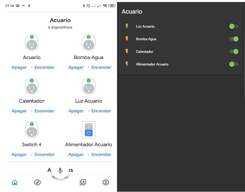

[ui-tabs position="top-left" active="0" theme="lite"]
[ui-tab title="Descripción ..."]

> Te presentamos algunas de las mejores regletas Wifi del mercado. Controla todos tus aparatos eléctricos desde tu dispositivo móvil de forma sencilla y eficiente.

Aúnque de momento no son muchos los fabricantes que se han lanzado a la fabricación de regletas Wifi, desde [domotizarmicasa.com](https://domotizarmicasa.com) estamos seguros de que ésta nueva forma de controlar la corriente eléctrica de tu casa va a ganar en adeptos en un futuro inmediato.

Completo control de la regleta vía Wifi:

+ Acepta múltiples conexiones Wifi simultáneas
+ Posibilidad de ahorro en el consumo eléctrico
+ Control individual de cada toma AC
+ Comodidad para controlar dispositivos
+ Opción de conexión con _Google Home_ o _Amazon Echo_.

Recordar que la mayoría de éstas regletas de conexión inalámbrica soportan sobrecargas, altas temperaturas y largas jornadas de trabajo como el resto de regletas de calidad.

!!! _"En mi caso, por ejemplo, tengo una regleta wifi 4 tomas y 4 USB, y **la tengo puesta en el acuario para controlar la luz, el calentador, el alimentador y la bomba de filtrado**. En el caso del calentador y de la bomba que están 24 horas funcionando, el alimentador y la luz están con timer programado, de esa manera se que esta mantenido aúnque yo no esté en casa por unos días, además está integrado en Home Assistant con lo que que me avisa vía Telegram si algo se apaga inesperadamente."_.



---

[ui-accordion independent=true open=none]

[ui-accordion-item title="Iraza Enchufe Múltiple Inteligente | Amazon » 28,66€ "]
|  |  |
|:-------------|:-------------:|
| <p>[**Iraza Enchufe Múltiple Inteligente...**](https://amzn.to/2J7yf7y)</p><p>Configuración simple y fácil de usar : Simplemente, siga los<br />pasos de instalación.<br />- Investigación y desarrollo independientes, fácil de operar.<br />- La conexión wifi es muy estable.<br />- Control de voz vía _Amazon Alexa_ y _Google Assistant._<br /> Puede activar o desactivar las 3 tomas por separado o jun-<br />tas y los 2 puertos USB a través de _Echo_, _Google Home_,<br />NEST y _Samsung Smart Things_ serán compatibles en breve.</p> | <div> ![200x200][amzn-iraza] <a href="https://amzn.to/2J7yf7y" alt="amazon-link" target="_blank"><button type="button" style="color:#fff;background-color:#1694CA;width:100%;height:35px;"><i class="fa fa-amazon">mazon</i></button></a> </div> |

|  |  |
|:-------------|:-------------:|
| <p>[**Iraza Enchufe Múltiple Inteligente...**](https://amzn.to/2J7yf7y)</p><p>Configuración simple y fácil de usar : Simplemente, siga los pasos de instalación.

+ Investigación y desarrollo independientes, fácil de operar. La conexión wifi es muy estable. Control de voz vía _Amazon Alexa_ y _Google Assistant.

+ Puede activar o desactivar las 3 tomas por separado o juntas y los 2 puertos USB a través de _Echo_, _Google Home_,<br />NEST y _Samsung Smart Things_ serán compatibles en breve. | <div> ![200x200][amzn-iraza] <a href="https://amzn.to/2J7yf7y" alt="amazon-link" target="_blank"><button type="button" style="color:#fff;background-color:#1694CA;width:100%;height:35px;"><i class="fa fa-amazon">mazon</i></button></a> </div> |


[/ui-accordion-item]

[ui-accordion-item title="Konesky Smart Power Strips | Amazon » 29.99€"]
|  |  |
|:-------------|:-------------:|
| <p>[**Konesky Smart Power Strips Wifi<br /> Protector contra sobretensiones con <br />4 salidas 4 puertos USB...**](https://amzn.to/2Valrih)</p><p>La regleta de alimentación inalámbrica Timmer es compatible<br />con los puertos USB, ahorra espacio y dinero, no necesita<br />comprar muchos enchufes ni banco de energía, la regleta<br /> multifuncional le permite cargar muchos dispositivos<br />al mismo tiempo. El control de voz de la toma de corriente<br />inteligente WIFI, puede controlar sus aplicaciones a través<br />de los dispositivos  _Alexa_, _Google Home_ e _IFTTT_. Conveniente<br />y fácil de usar.</p> | <div> ![200x200][amzn-Konesky] <a href="https://amzn.to/2Valrih" alt="amazon-link" target="_blank"><button type="button" style="color:#fff;background-color:#1694CA;width:100%;height:35px;"><i class="fa fa-amazon">mazon</i></button></a> </div> |
[/ui-accordion-item]

[ui-accordion-item title="Lightweight Smart Power 4 Strips | Aliexpress » 27,54€ "]
|  |  |
|:-------------|:-------------:|
| <p>[**Smart Wifi Plug Power Strip Protector contra sobreten-<br />siones. Múltiples tomas de corriente,<br />4 puertos USB Control de voz para Alexa y Google Home**](http://s.click.aliexpress.com/e/cj0gMOCs)</p><p>Soporte para altavoz inteligente: _Amazon Alexa_, _Google<br />Home_, _IFTTT_.  Control remoto del teléfono móvil cuando<br />el teléfono móvil y la toma de corriente están conectados<br />a Internet, la toma móvil puede controlarse remotamente<br />mediante la aplicación móvil.<br />- **Cambio manual** del estado de conexión / desconexión.<br />- **Función de tiempo**.<br />- **Actualización en línea** cuando salga una nueva versión<br />del firmware, podrá actualizarse en línea directamente<br />en la aplicación y disfrutar de más funciones.<br />- **Intercambio inteligente**: Comparte tu dispositivo con<br />amigos y/o familia.</p> |  <div> ![200x200][amzn-Lightweight] <a href="http://s.click.aliexpress.com/e/cj0gMOCs" alt="AlieExpress-link" target="_blank"><button type="button" style="color:#fff;background-color:#e8a100;width:100%;height:35px;"><i class="fa fa-shopping-cart"> AliExpress</i></button></a> </div> |
[/ui-accordion-item]

[/ui-accordion]

<!--- REFERENCIA A IMAGENES AL PIE DEl ARTÍCULO --->

[amzn-iraza]: user://pages/03.enchufes-Inteligentes/02.regletas-wifi/iraza.png?lightbox=1024&cropResize=200,200
[amzn-Konesky]: user://pages/03.enchufes-Inteligentes/02.regletas-wifi/Konesky.png?lightbox=1024&cropResize=200,200
[amzn-Lightweight]: user://pages/03.enchufes-Inteligentes/02.regletas-wifi/ligthweight.png?lightbox=1024&cropResize=200,200

---

[](# "Volver al Inicio")

[/ui-tab]

[ui-tab title="Integración ..."]

La **Integración en Google Home** es muy secilla, solo tienes que añadir la cuenta que creas de la aplicacion del disposivo, en este caso sera **_Smart Life_**  o  **_Tuya_**,  en la configuración de añadir dispositivos de _Google Home_, aquí tenéis el enlace para descargarlo:
 * [**Smart Life android**](http://bit.ly/2JnEUtN)
 * [**Smart Life Iphone**](https://apple.co/2DVyRsK)
 * [**Tuya Android**](http://bit.ly/2ZYql5T)
 * [**Tuya iphone**](https://apple.co/2vIrNeD)

###### **_(Aúnque en el Ejemplo usamos la aplicación Kasa, el procedimiento para la integración és el mismo, utilizando la aplicación correcta del componente, arriba indicada, según proceda)._**.###### 


**Para Integrarlo en Home Assitant**
Solo necesitaras anadir a tu `configuration.yaml` los siguientes datos:

+ Ejemplo  App Tuya `configuration.yaml`:

```text

tuya:
  username: nuestro@correo.es
  password: contraseñaquepusimos
  country_code: 34 

```
+ Ejemplo  App Smart Life `configuration.yaml`:

```text
​
tuya:
  username: nuestro@correo.es
  password: contraseñaquepusimos
  country_code: 34
  platform: smart_life
​
```
---

[/ui-tab]

[/ui-tabs]
