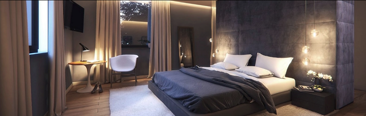

[ui-tabs position="top-left" active="0" theme="lite"]
[ui-tab title="Descripción ..."]

> Las tiras LED son un tipo de iluminación increíblemente versátil, con una amplia variedad de usos que pueden ir desde decorativos hasta usos más funcionales y profesionales. Esta versatilidad se refleja principalmente en su facilidad de instalación y las múltiples características que presentan los diferentes tipos de tiras de luces ...

Son un tipo de iluminación cada vez más utilizadas por las personas que buscan conseguir el máximo ahorro posible. **Pueden consumir hasta un 80% menos de energía que las bombillas tradicionales**, además de tener una duración claramente superior.

!!! **Otra de las grandes ventajas de una tira led es que es autoadhesiva** por lo que es muy sencilla adaptarla a cualquier tipo de superficie. Además, su iluminación es muy nítida, no causará ningún tipo de reflejo y será capaz de adaptarse a nuestra vista sin cansarla de ninguna manera.
Tienen  múltiples funciones son como perfecto acompañamiento de luz para espacios fijos que necesitas alumbrar, como un hueco en un cabecero, una guardilla en el pasillo, en el baño...

> _!Convierte la iluminación de tu casa en una experiencia extraordinaria propia de una casa inteligente!_

---

[ui-accordion independent=true open=none]

[ui-accordion-item title="Tira LED Tira Iluminación Inteligente RGB   | Amazon » 29,99€ "]

|  |  |
|:------|:-----------------------:|
| <p>[**Tira LED Tira Iluminación Inteligente RGB ...**](https://amzn.to/2Wvcghj)</p><p>WIFI Tira LED Tira Iluminación Inteligente RGB 5M</p><p> Bawoo 150 LED Smart Strip LED Impermeable ALEXA Google Home IFTTT. Teléfono Control Remoto 24 Teclas.</p><p> Puede controlar la tira de LED utilizando la aplicación **Magic Home** para encenderla, apagarla, cambiar de color, agregar un programa, crear un escenario...</p> | <div> ![img-500crop][amzn-led5m] </div> <div> <a href="https://amzn.to/2Wvcghj" alt="amazon-link" target="_blank"><button type="button" style="color:#fff;background-color:#1694CA;width:100%;height:35px;margin:5px;"><i class="fa fa-amazon fa-lg">mazon</i></button></a> </div> |

[/ui-accordion-item]

[ui-accordion-item title=" Tira de LED 15 metros WiFi + controlador | Aliexpress » 19,63€"]

|  |  |
|:------|:-----------------------:|
| <p>[**Tira de LED 15 metros WiFi + controlador...**](http://s.click.aliexpress.com/e/rvpMQA8)</p> Tira de LED de 15 metros (3 rollos de 5 metros cada uno) con la controladora WiFi **Magic Home**.</p><p> Es compatible con _Alexa_, Google Assistant y además nos permite integrarlo en _Home Assistant_ sin cambio de firmware.</p><p> La tira es cortable por lo que podéis aprovecharlo en diferentes proyectos.</p> | <div> ![img-500crop][ali-led15m] </div> <div> <a href="http://s.click.aliexpress.com/e/rvpMQA8" alt="AlieExpress-link" target="_blank"> <button type="button" style="color:#fff;background-color:#e8a100;width:100%;height:35px;"><i class="fa fa-shopping-cart  fa-lg"> AliExpress</i></button></a> </div> |

[/ui-accordion-item]

[ui-accordion-item title="Controlador Remoto Wifi Tira Led   | Amazon » 12,98€ "]

|  |  |
|:------|:-----------------------:|
| <p>[**Controlador Remoto Wifi Controlador de Tira Led...**](https://amzn.to/2VYXivD)</p><p>Tome el control total de su iluminación con un teléfono, encienda o apague los dispositivos conectados donde sea que esté en cualquier momento a través de cualquier conexión a Internet.</p><p>Al utilizar la función Mic y Music Function, la tira de luz baila al ritmo de la música, es una fiesta Essentials; Transforme su espacio con más de 16 millones de colores y mil tonos de blanco.</p><p> Da un paso más y da vida a tus salas con temas y animaciones. Puede controlar la tira de LED utilizando la aplicación **Magic Home**</p> | <div> ![img-500crop][amzn-control2] </div> <div> <a href="https://amzn.to/2VYXivD" alt="amazon-link" target="_blank"><button type="button" style="color:#fff;background-color:#1694CA;width:100%;height:35px;margin:5px;"><i class="fa fa-amazon fa-lg">mazon</i></button></a> </div> |

[/ui-accordion-item]

[ui-accordion-item title="Controlador MINI WIFI/RGB/RGBW/RGB-WW-CW tira LED  | Aliexpress » 5,45€ - 12,75€ "]

|  |  |
|:------|:-----------------------:|
| <p>[**Controlador Remoto Wifi Controlador de Tira Led...**](http://s.click.aliexpress.com/e/bSeK33fa)</p><p>Controlador LED que nos permite variar por completo la iluminación de nuestra tira de LED.</p><p> Es uno de los controladores más usados gracias a que permite el cambio de firmware y lo podemos integrar en cualquier sistema. Sin modificar, su App ya es compatible con _Alexa_ y con _Google Assistant_ y podemos integrarlo en _Home Assistant_.</p><p> Puede controlar la tira de LED utilizando la aplicación **Magic Home**</p> | <div> ![img-500crop][ali-control1] </div> <div> <a href="http://s.click.aliexpress.com/e/bSeK33fa" alt="AlieExpress-link" target="_blank"> <button type="button" style="color:#fff;background-color:#e8a100;width:100%;height:35px;"><i class="fa fa-shopping-cart  fa-lg"> AliExpress</i></button></a> </div> |

[/ui-accordion-item]

[/ui-accordion]

<!--- REFERENCIA A IMAGENES AL PIE DEl ARTÍCULO --->

[amzn-led5m]: user://pages/09.iluminacion/02.tiras-de-led/tira_led_5m.png?lightbox=1024&cropResize=500,500
[ali-led15m]: user://pages/09.iluminacion/02.tiras-de-led/tira_led_15m.png?lightbox=1024&cropResize=500,500
[amzn-b.teckin]: user://pages/09.iluminacion/01.bombillas-wifi/bombilla_teckin.png?lightbox=1024&cropResize=500,500
[ali-control1]: user://pages/09.iluminacion/02.tiras-de-led/comtrol1.png?lightbox=1024&cropResize=500,500
[amzn-control2]: user://pages/09.iluminacion/02.tiras-de-led/comtrol2.png?lightbox=1024&cropResize=500,500
[int-ghome]: user://pages/02.interruptores/integracion_google_home.gif
---

[](# "Volver al Inicio")

[/ui-tab]

[ui-tab title="Integración ..."]

La **Integración en Google Home** es muy secilla, solo tienes que añadir la cuenta que creas de la aplicacion del disposivo, en este caso sera **_	
Magic Home Pro_**, en la configuración de añadir dispositivos de _Google Home_, aquí tenéis el enlace para descargarlo:
 * [**Magic Home Pro android**](http://bit.ly/2XlOxxq)
 * [**Magic Home Wifi Iphone**](https://apple.co/2wrEvyN)


###### **_(Aúnque en el Ejemplo usamos la aplicación Kasa, el procedimiento para la integración és el mismo, utilizando la aplicación correcta del componente, arriba indicada, según proceda)._**.###### 
![int-ghome]

**Para Integrarlo en Home Assitant**
Solo necesitaras anadir a tu `configuration.yaml` los siguientes datos:

+ Ejemplo `configuration.yaml`:

```text

light:
  - platform: flux_led
    devices:
      192.168.1.10
        name: Salon

```
---
[](# "Volver al Inicio")

[/ui-tab]

[/ui-tabs]