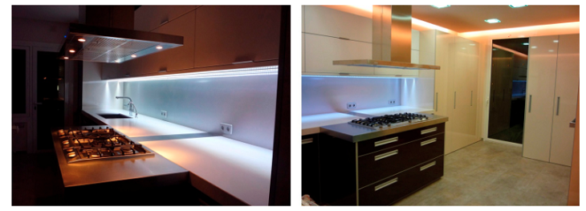

!!! Si hay algo que me gusta especialmente de los equipos de domótica es el control de la iluminación. Por una simple razón: la iluminación es capaz de crear ambientes y escenas. No necesitamos la misma luz cuando estamos jugando con nuestros pequeños que cuando vemos una película, leemos una novela negra o cenamos con nuestra pareja.

La iluminación de un hogar es la parte más importante que aporta encanto y personalidad a cada una de las estancias. La luz contribuye en nuestra comodidad y bienestar que nos acompaña en muchas actividades que realizamos en el hogar.

Gracias a la domótica, puedes controlar todos los elementos de iluminación sin necesidad de estar en casa, desde cualquier parte del mundo, con tu móvil y una simple conexión a Internet y a traves de _**Home Assistant**_ podrás automatizar estancias que suelen ser repetitivas.

Con los diferentes sistemas de encendido (pulsador, App, programado, pulsando escena o mediante la voz) le resultará mucho más cómodo  y rápido.
Los equipos de iluminación domótica son variados dependiendo de las estancias que queramos iluminar, existen en el mercado diferentes tipos:

- Bombillas Wifi
- Tiras de led Wifi
- Lámparas de Escritorio Wifi
- Lámparas de Noche
- Controladores Wifi RGB/W (para tiras de led Standards)
- Casquillos Hub Wifi

Todos ellos son integrables en _**Home Assistant**_ y en _**Google Home**_

---
